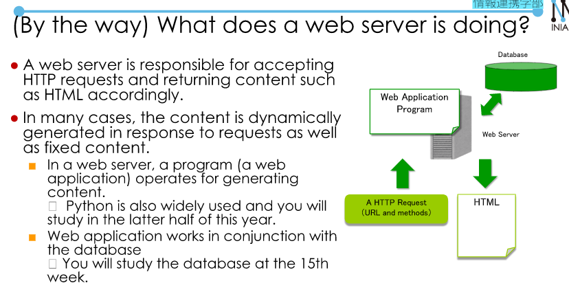
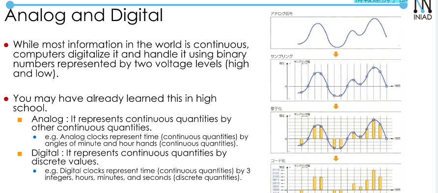

# Web and User Interface.  
## How a website is displayed.  
Basically, it works as follows:  
- A web broweser.  
- Downloads the contents specified by URL.  
- From the web server on the Interneet.  
- Using protocols like HTTP.  
- And the displays them to the user.  

Start from this week, we will learn: HTML, CSS, and JavaScript.  
- Information representation using HTML.  
- CSS --> Laying out the page.  
- JavaScript. --> Changing the page dynamically.  

  

## User interface.  

  

Style in User Interface?  
- CUI (Character User Interface).  
    + Input: Character input from a keyboard.  
    + Output: String indication on a display.  
    --> For example: CMD, REPL.  

- GUI (Graphical User Interface):  
    + Input: A pointing device such as a mouse.  
    + Output: Display graphics (windows, icons, etc...) on the display.  
    --> Style that presents information visually and allows the user to intuitively perform operations.  
    For example: Desktop metaphor.  
- Fitt's Law:  
    

  

## (Review) Representation of Information.  

  

  

  

  

  

[Binary to Hex conversion] (https://www.rapidtables.com/convert/number/decimal-to-hex.html)  
  

