# Information Representation using HTML.  
## Markup language.  

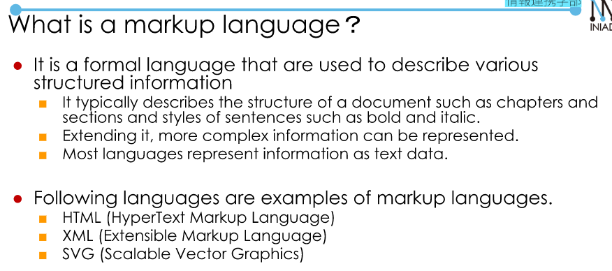  

### Let's look at HTML.  
- Open the link [INIAD](https://repl.it/@iniadcs/INIAD-HTML-Sample-1e).  

- How to check the contents:  
    + Open the page using Chrome.  
    + Right-click the displayed page.  
    + Select "View Page Source".  

### Markup by Tags:  
- Tag: `<>`  

HTML is a collection of Elements:  `<Element>Content<Element>`.  
- `<Element>` is some tag used without end tag and contents. 
- This kind of tag is called "empty elements".  

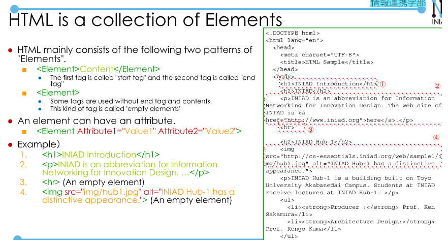  

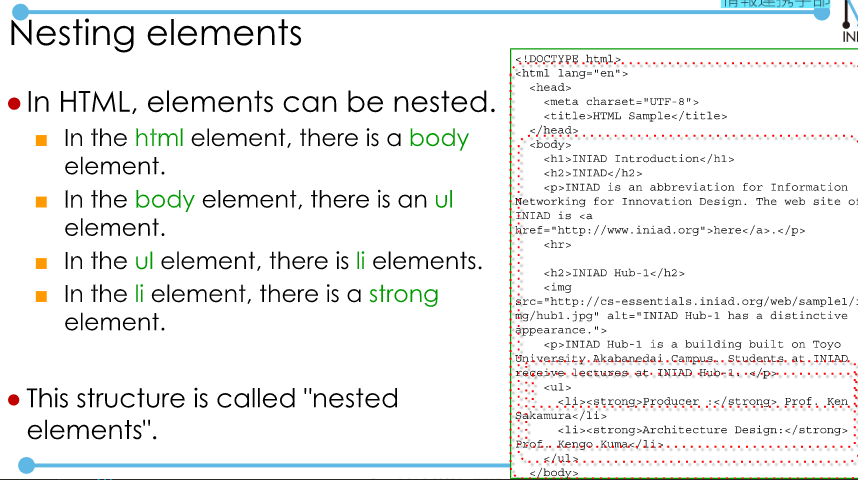  

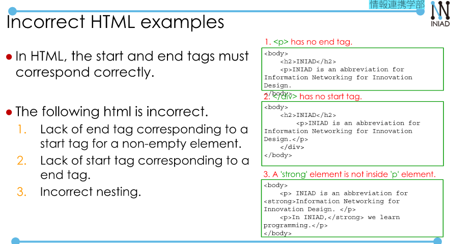  

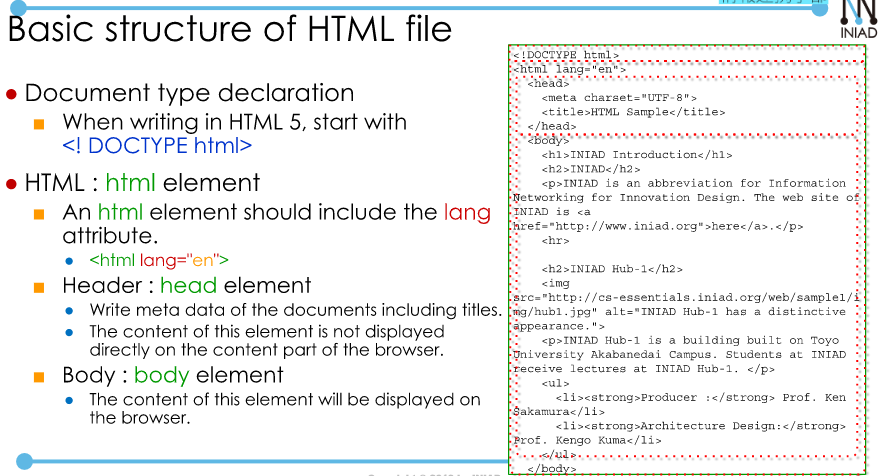  

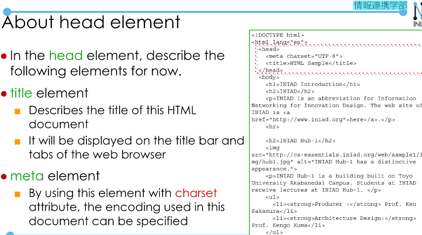  
## Basic elements.  
- h1...h6: heading.  
- p(paragraph) elements.  

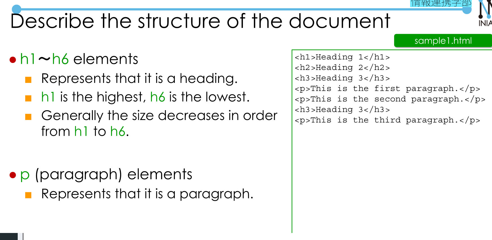  

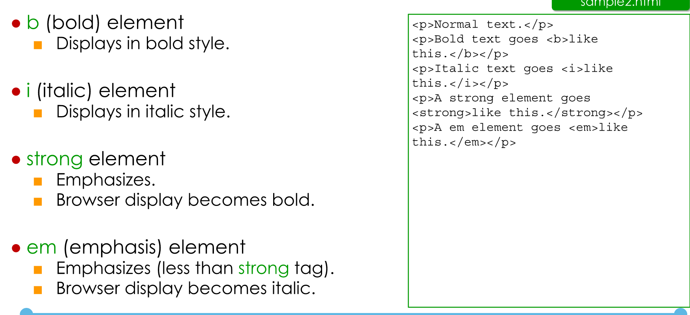  

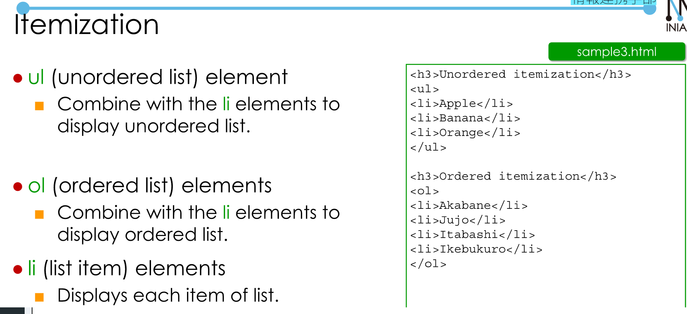  

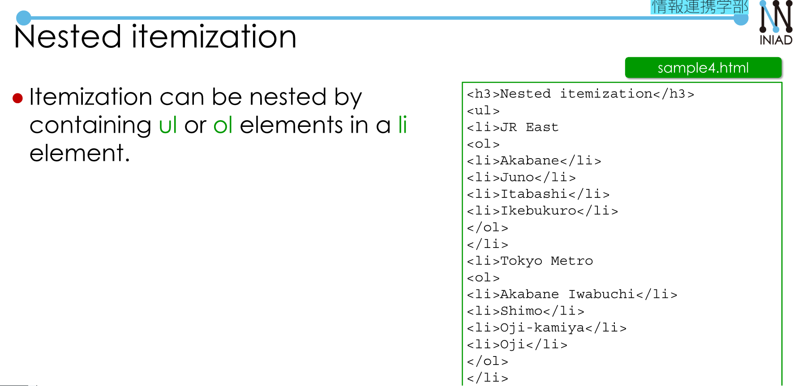  

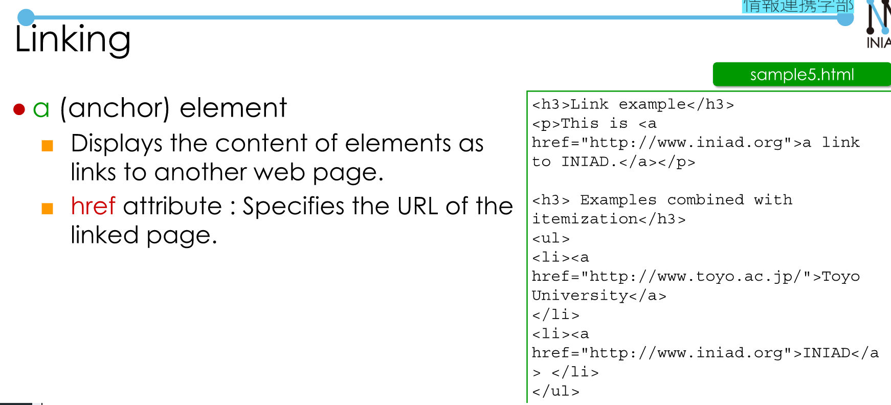  

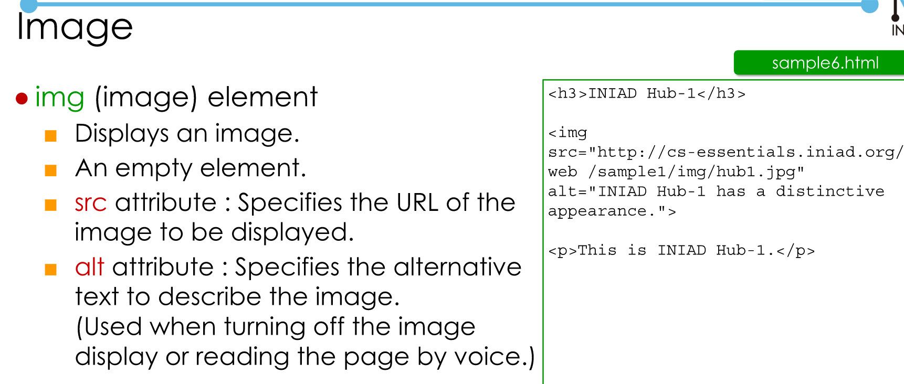  

Document: [HTML](https://developer.mozilla.org/ja/docs/Web/HTML)  
Some familier tags:  
- `<!DOCTYPE html>`: Type of file  
- `<a href = "Link"> Content <\a>`: anchor - link to a page.  
- ``: Link a image.  
- `<h1>...<h6>`: Heading  
- `<p>`: Paragraph  
- `<ul>`: unordered list  
- `<ol>`: ordered list.  
- `<li>`: list.  
- `<b>`, `<strong>`: bold, or emphasisis  
- `<i>`, `<em>`: italics  
Sample code:  
```
<!DOCTYPE html>
<html>

<head>
    <title>Sample page</title>
    <meta charset="utf-8">
</head>

<body>
    <h1>Sample page</h1>
    <p>
        this is a <a href="demo.html"> simple </a> sample.
    </p>
    <!--this is a comment-->
</body>

</html>
```

 


