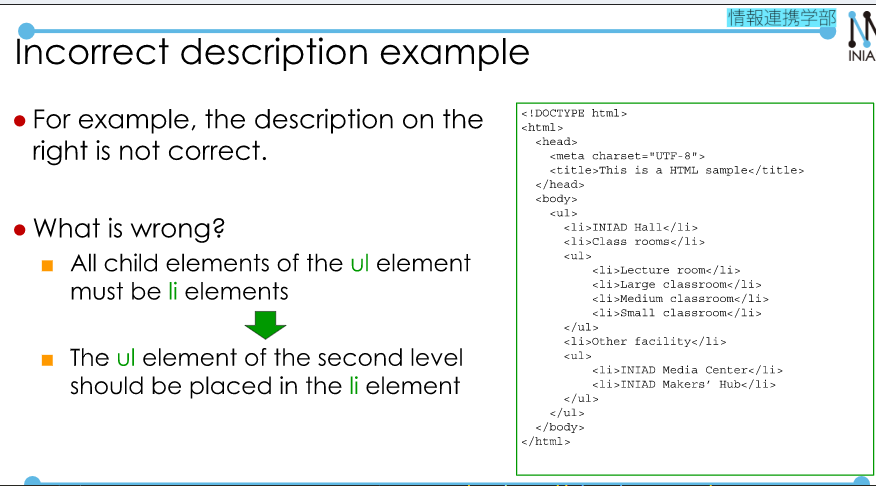

# Information Representation using HTML 2  
## 1. How to specify the URL in HTML.  

  

  

  

  

  

  

  

  

## 2. Table and Forms.  

  

[Sample 1](./sample1.html)  

  

[Sample 2](./sample2.html)  

  
[Sample 3](./sample3.html)  

  

  

  

  

  

## 3. Rules of HTML Description.  

  

  

  

  

  

**Note**: You can also check the HTML code in [here](https://validator.w3.org/#validate_by_input).  

