# CSS Basic.  
## 1. CSS  
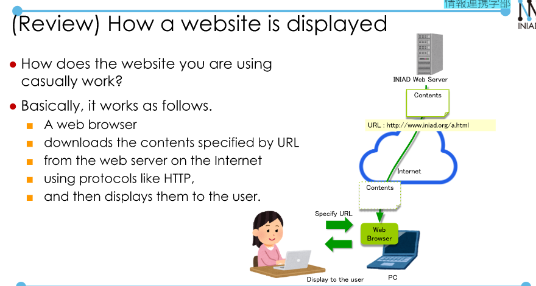  

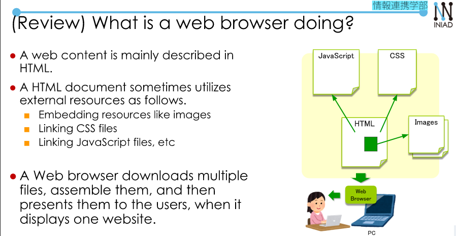  

  

  

  

## 2. CSS Basics.  
**How to apply CSS to HTML**  
We need to add description in `head` element: `<link rel="stylesheet" type = "text/css" href = "URL of CSS file">`  

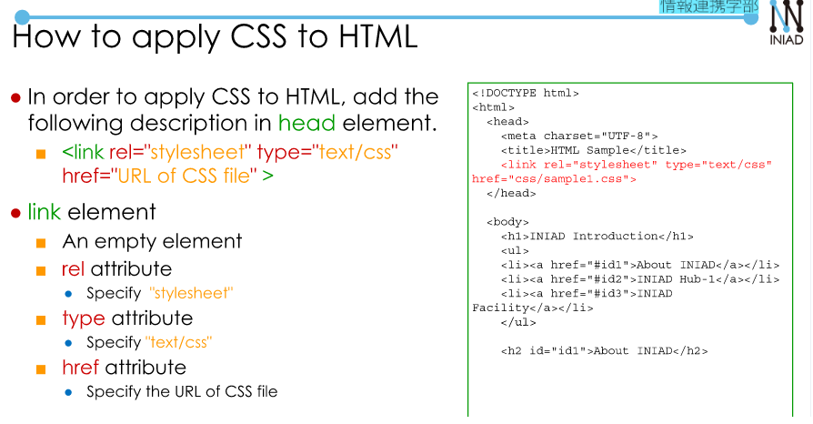  
```
<!DOCTYPE html>
<html lang="en">
  <head>
    <meta charset="UTF-8">
    <title>HTML Sample</title>
    <link rel="stylesheet" type = "text/css" href = "css/sample1.css">  
  </head>
...
```  
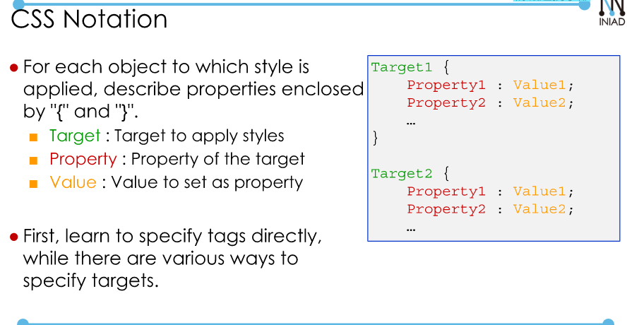  
```
h1 {
    font-family : sans-serif;
    font-size : 24px;
    text-shadow : 2px 2px 2px #aaaaaa;
    text-align: center;
}

h2 {
    font-family : sans-serif;
    font-size : 20px;
    text-decoration : underline;
    background-color: #ffcccc;
    padding: 10px;
    border-left: solid 3px #ff7777;
}
```  
**CSS property**  
CSS have various properties.  
**Note** you can learn from here: [Source](https://developer.mozilla.org/en-US/docs/Web/CSS/Reference)  
- `color`: the text color.  
- `background-color`: specify the background color.  

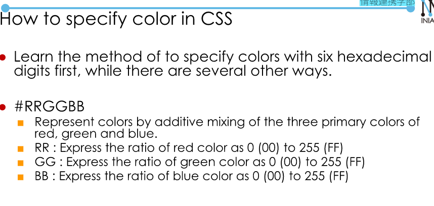  

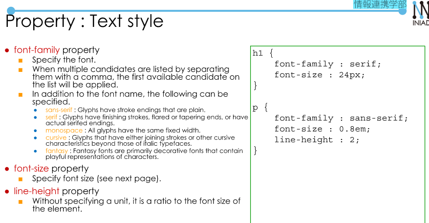  

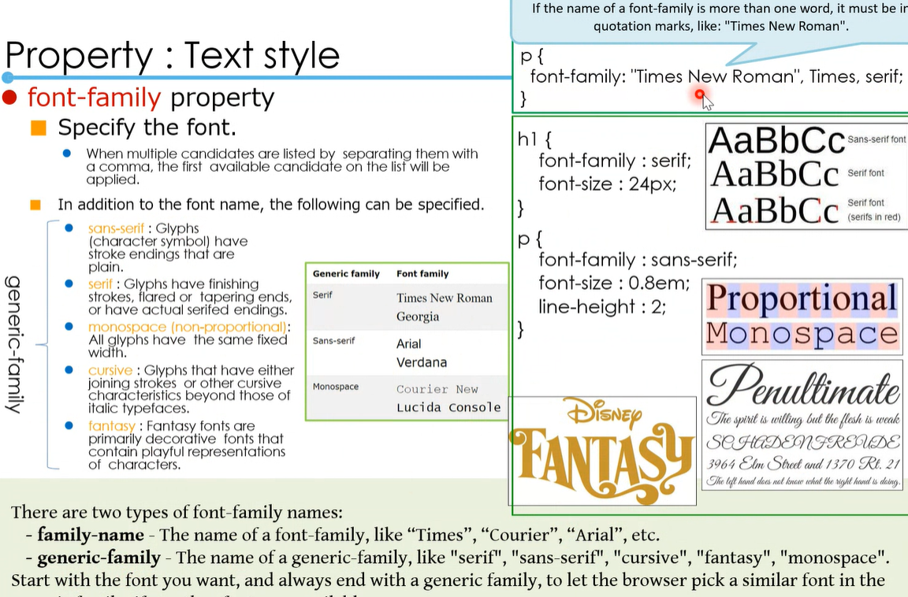

- `font-family`: specify the font.  
--> `sans-serif`, `serif`, `monospace`, `cursive`, `fantasy`.  
- `font-size`: size.  
- `line-height`.  
- `text-align`: specify alignment (`left`, `center`, `right`).  
- `text-decoration`: specify the text decoration (`underline`, `overline`, `line-through`).  
- `text-shadow`.  

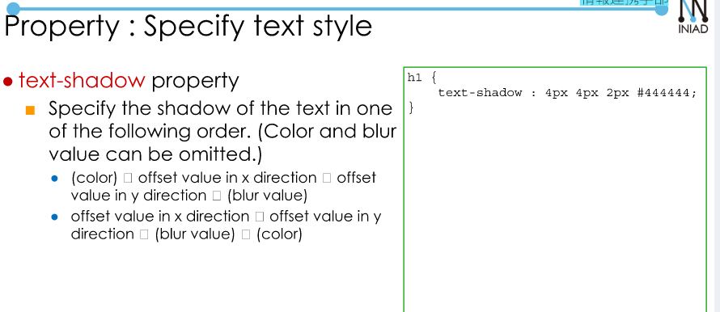  

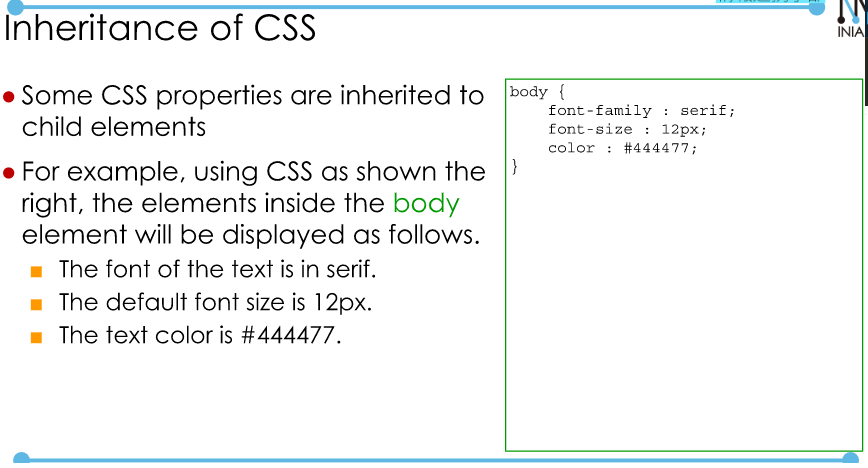  

## 2. Specify the layout.  

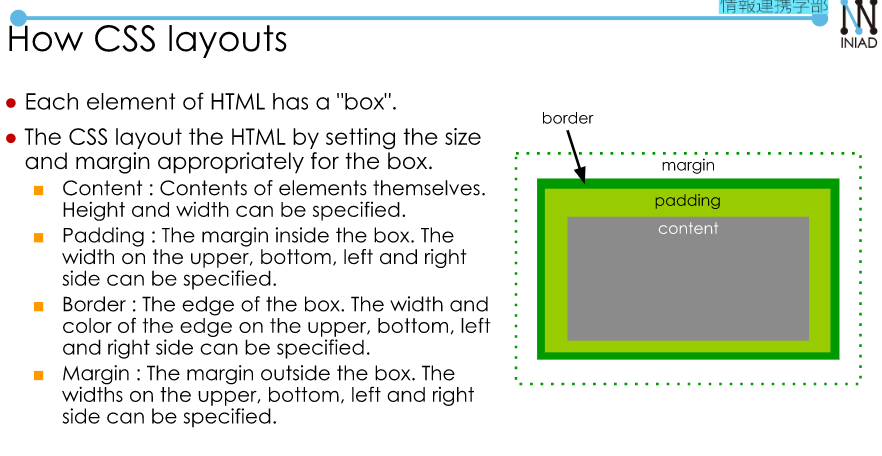  

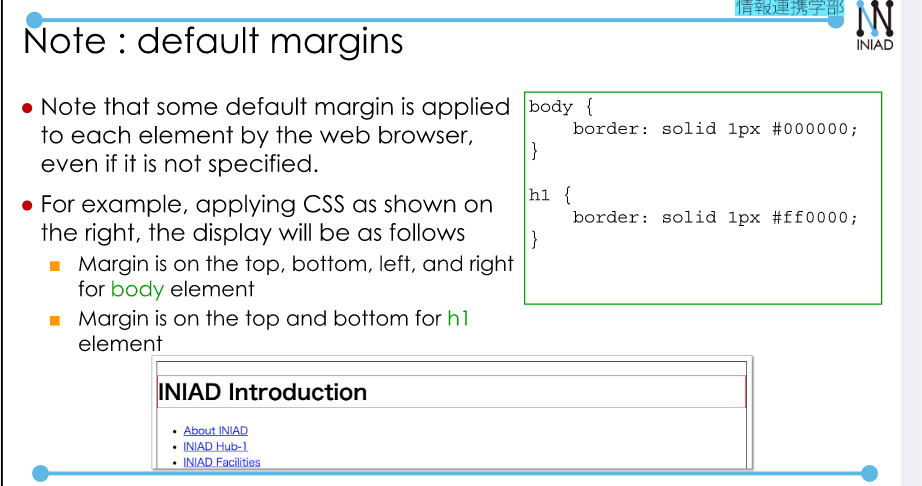  

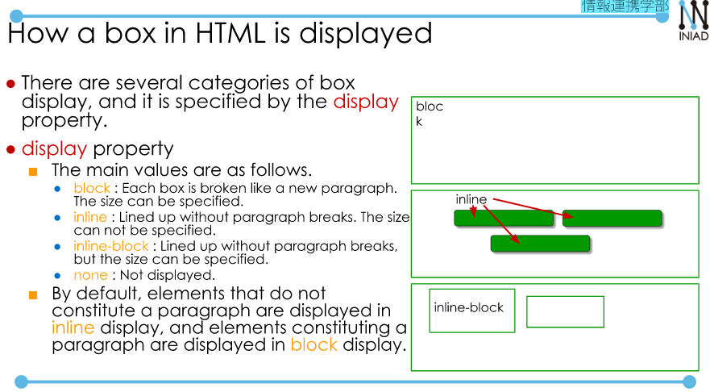  

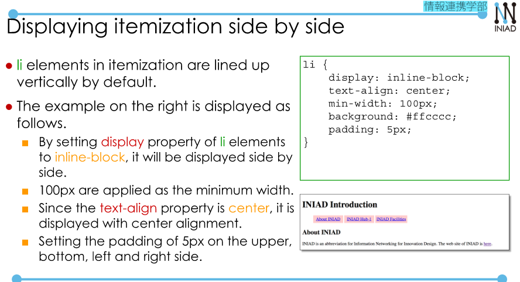  

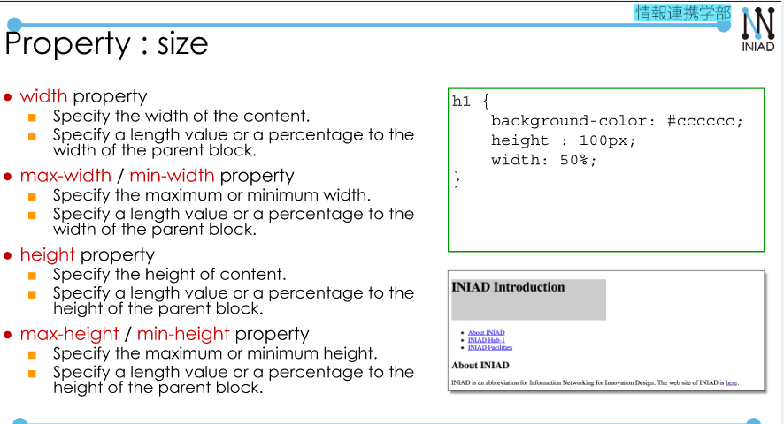  

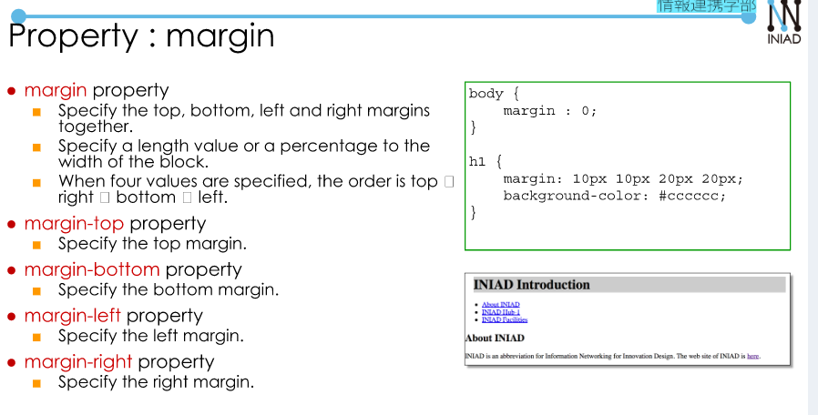  

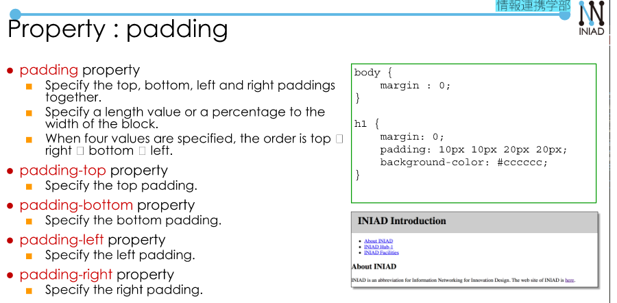  

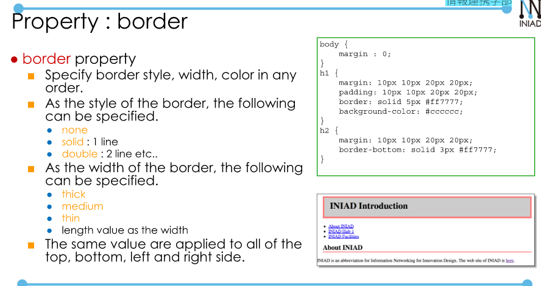  

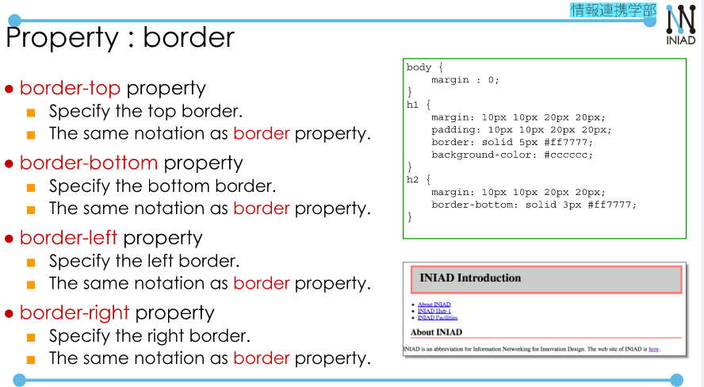  


