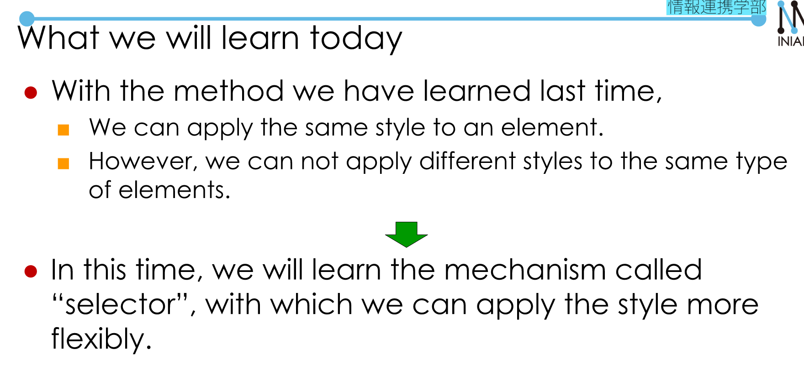
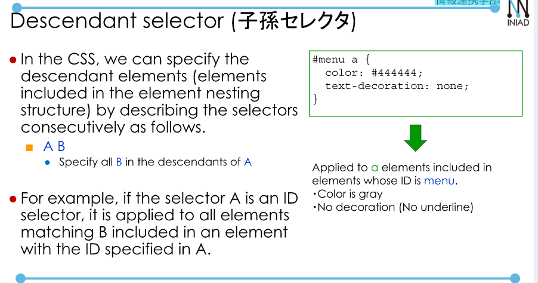

# CSS part 2  
## Specify the elements using selectors  

  

  

### ID  

  

  

### Class

  

  

  

[**Resource**](https://developer.mozilla.org/ja/docs/Web/CSS/Reference)  

  

  

## More flexible styling  

  

  

  

  

  

  

  

  

  

