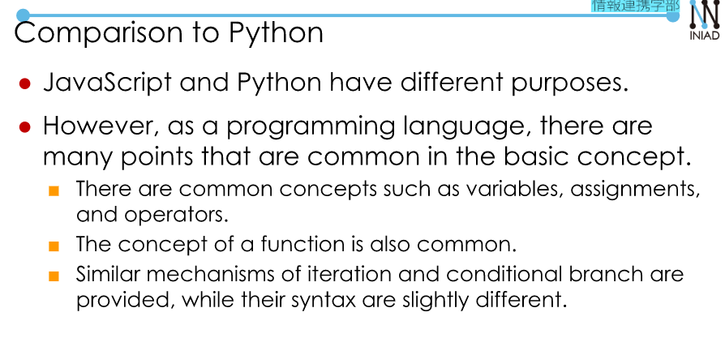
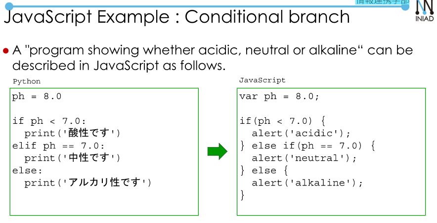
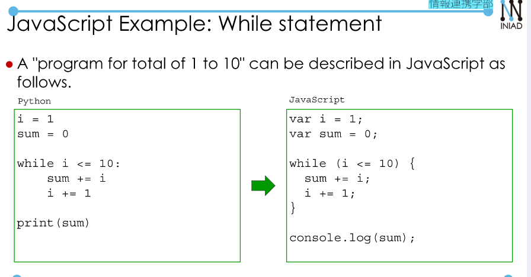
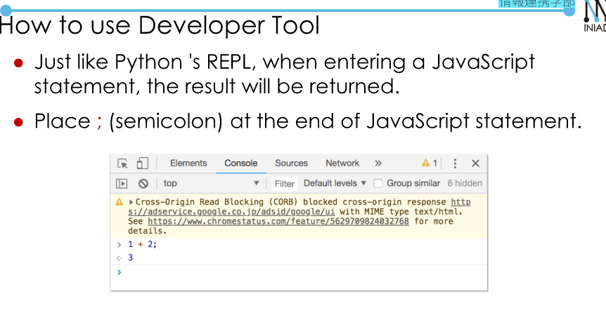
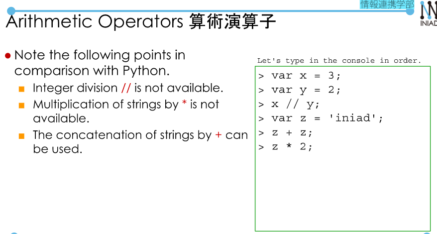
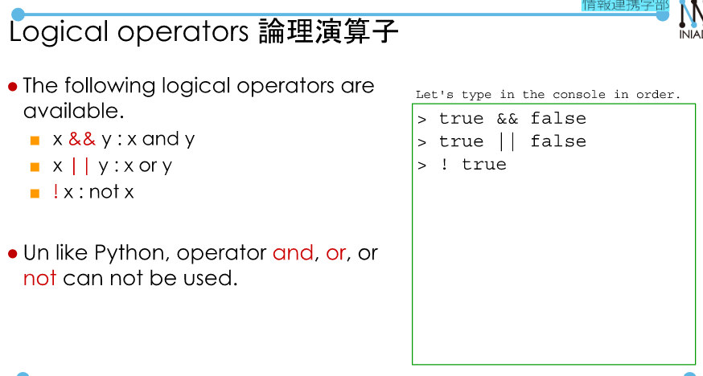
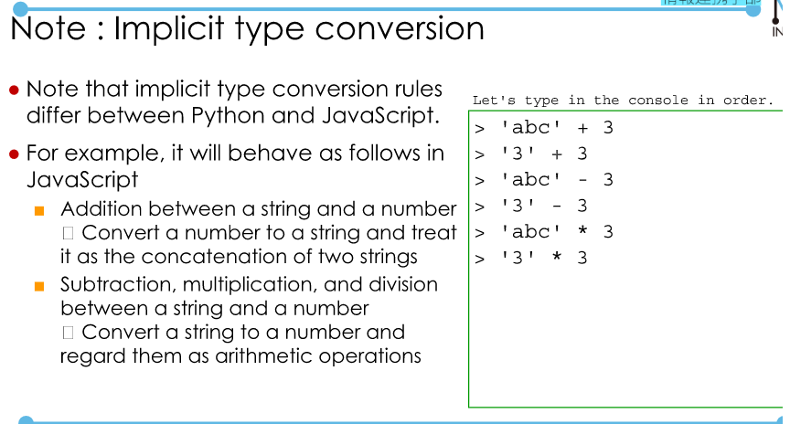
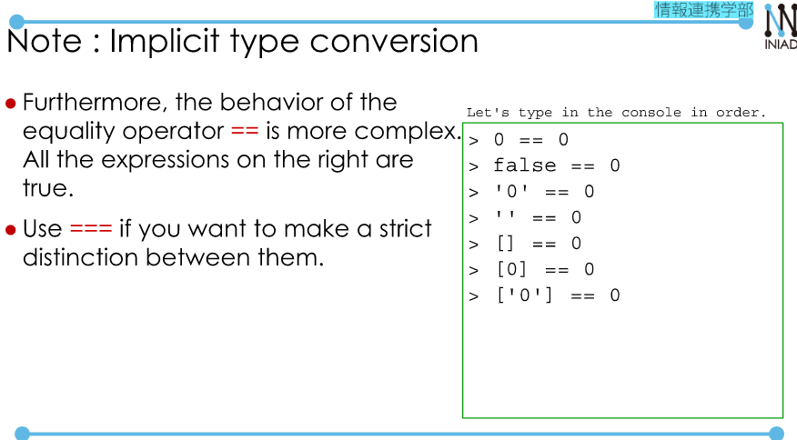

# JavaScript  
## JavaScript Basics  
By using JavaScript, we can add dynamic behavior to websites written in HTML.  

  
**JavaScript Example: Function**  
```
function area(r){
    return (r ** 2) * 3.14159;
}
console.log('The area of the circle:', area(10))
```  

  

  

[Resource](https://developer.mozilla.org/en-US/docs/Web/JavaScript)  

JavaScript console: a developer tool in Chrome.  

  
**Variable**  
- Use `var variable-name = initial-value;` to declare a variable.  

  

**Arthimetic Operators**: Similar to C++ (except: `**`)  

  

**Comparison operators**:  
- `===` strictly equal  
- `!==` strictly not equal  
**Logic**  

  

**Type conversion**  
- `parseInt(String, N)`: convert a string into N-ary numbers.  
- `parseFloat(String)`: convert a string into a float.  
- `String(Number)`: Number to string.  
- `Number(string)`: Returns numeric value of String.   
- `Number.toFixed(2)`: round.  

  

  

## Programs in JavaScript.  

**String output in JavaScript**  
- `console.log` == `print` in Python.  
- `alert(arg)` Output argument values to the dialog.  
- Block `{}`  
- Comment, For, While similar to C++.  
- Function.  
```
function area(r){
    return (r ** 2) * 3.14159;
}
console.log('The area of the circle:', area(10))
```  

```

function permutation(n, k) {
    var ans = 1;
    for (var i=k+1;i<=n;++i) ans *= i;
    return ans;
}

var p = permutation(10, 3);
console.log(p);
```  


