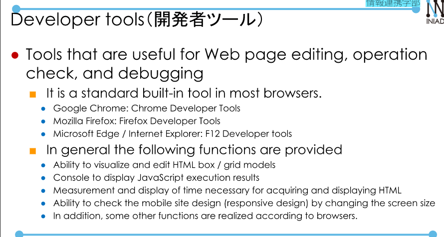
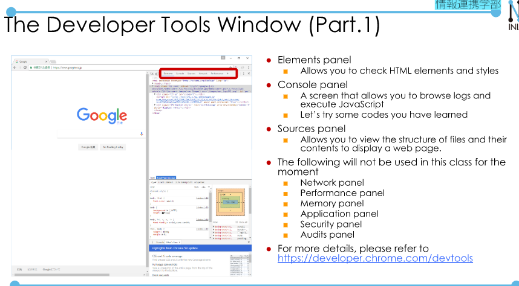
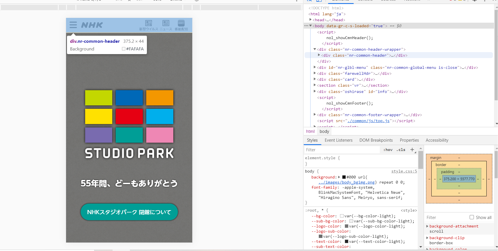
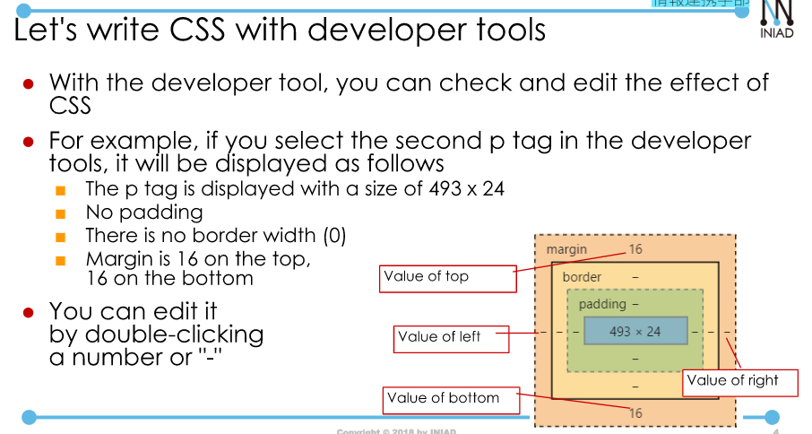
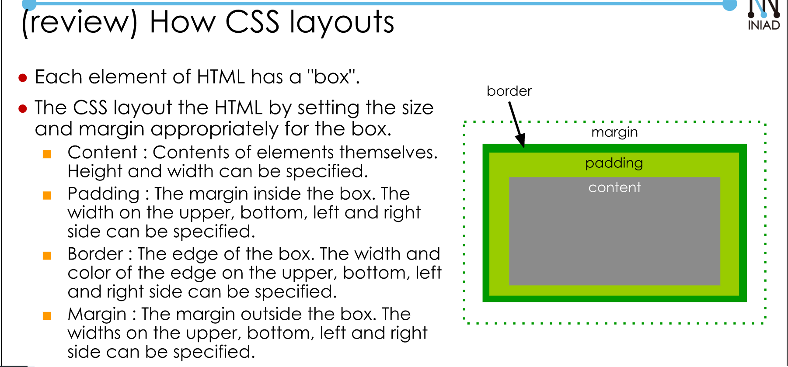
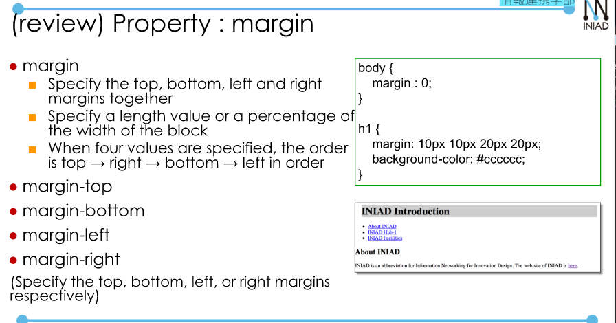
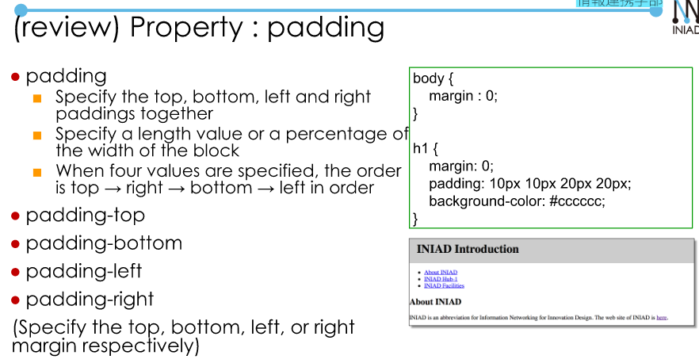
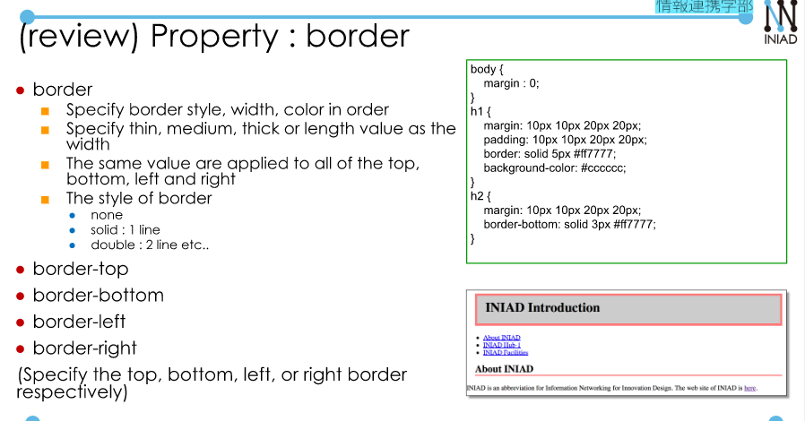
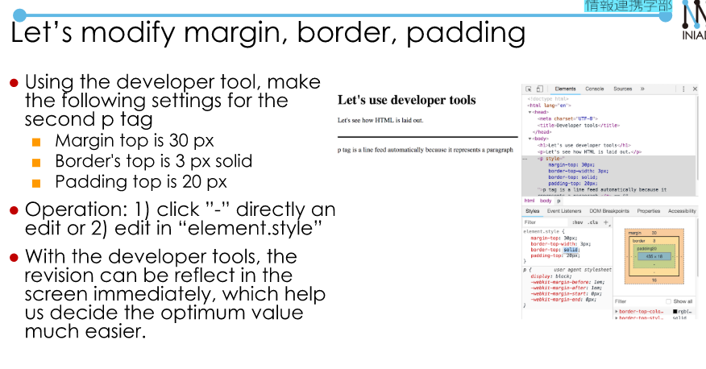

# Developer tools  
- Tools that are useful for web page editing, operation check and debugging.  

  
- Open Chrome menu --> Tools --> More tools --> Developer tools.  
- It contains:  
    + Elements panel. (HTML)    
    + Console panel.  (JavaScript)  
    + Source panel. Allows you to view the structure of files and their contents to display a web page.   

  
- Device mode (switch to smartphone display).  
- Element selector. (You can check how HTML tags are used).  

  

## Let's rewrite the HTML file with developer tools append.  

  

  

  

  

  

  

