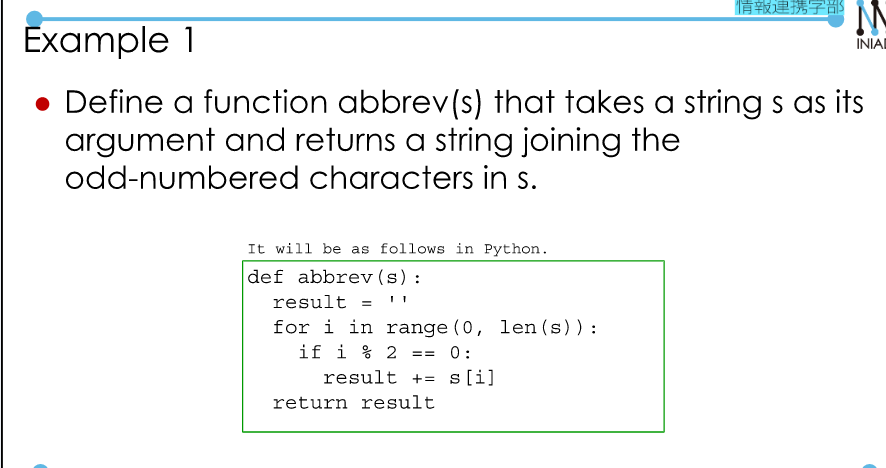
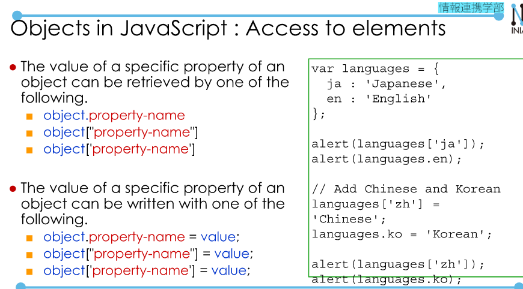
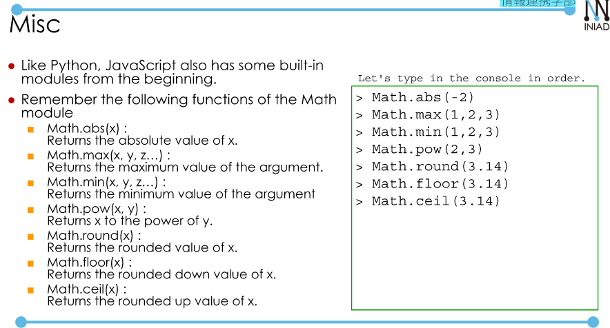
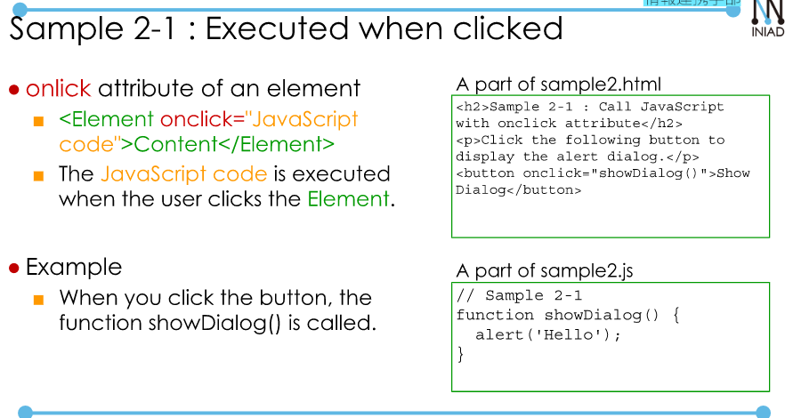
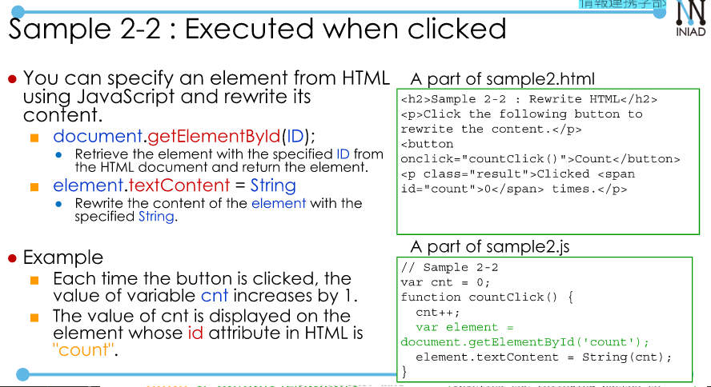

# JavaScript 2  
## String, Array, and Object  
**String**  
- Work as C++  
- String length: `string.length`  

Some interesting methods:  
- `string.indexOf(target)`: search target, not find then return -1.  
- `string.startsWith(target)`: Return True if string starts with target.  
- `string.endsWith(Target)`: opposite to `startsWith`.  

  
**Arrays**  
- Init: `[element1, element2, ...]`  
- Length: `array.length`  
- `push` + `pop`  
- `array.slice(N, M)`: Slice from N-th element to M-1 th elements of array.  
- Iteration: `for (var variable of array)`  

**Object**  
- Can be used as dictionaries in python.  
```
{
    property-1: value-1
    property-2: value-2
    property-3: value-3
    ...
}
```  
  

- `in`: `property-name in object`  
**Sorting in JavaScript**  
- `arr.sort()`  
- Use compare function:  
```
function compare(a,b){
    if (a < b) return -1;
    return 1; // a > b
    return 0; // a = 0
}
var points = [40, 100, 1, 5, 25, 10];
points.sort(function(a, b){return a - b});
```

**Misc**  
  

## Incorporate HTML into JavaScript  
How to call JavaScripts in HTML file.  
```
<head>
    ...
    <script src="js/assignment.js"></script>
<head>
```  
**Sample 2-1**  
  

**Sample 2-2**  
  
- `document.getElementById(ID)` Retrieve the element with the specified ID.  
- `element.textContent = String`: Rewrite the content with the specified string.  
```
function plus() {
    cnt++;
    var element = document.getElementById("count");
    element.textContent = String(cnt)
}
```  


 

