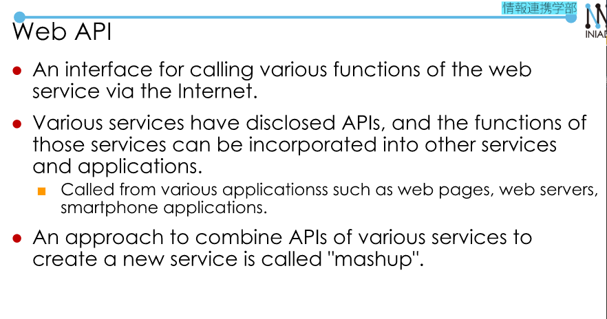
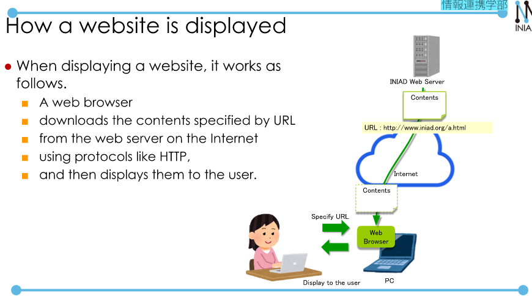
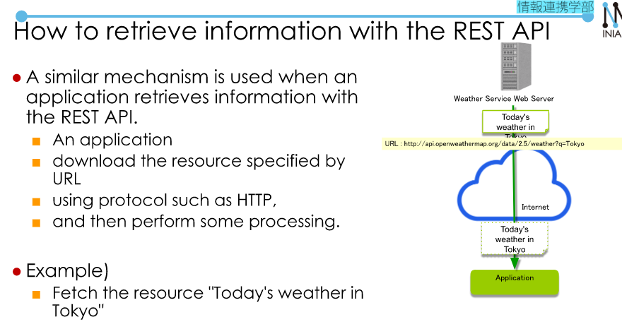
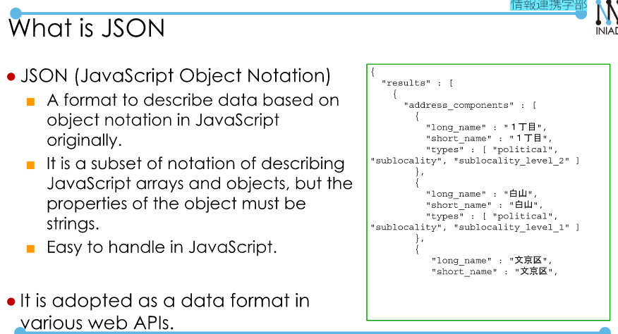

# Web API  
## (Review)What is Interface?  
- A point of interaction between two things.  
- API (Application Programming Interface)  
    + An interface for utilizing functions of various targets from the application software such as: OS, Library, **Web service**, IoT devices,...  
- Web API  
  

Example of Web API: Google Maps API, Twitter API, Facebook API,...  
[Face Recognition API](https://azure.microsoft.com/ja-jp/services/cognitive-services/face/)  
## REST API  
REST (Representational State Transfer) API  
- stateless  
- the operation is modeled as that on information (resource) represented by URL according to the specification of HTTP.  

  

  

**JSON(JavaScript Object Notation)**  
   

**API Key**  
- By using API key the web server specifies who access the function and uses it for access control.  

