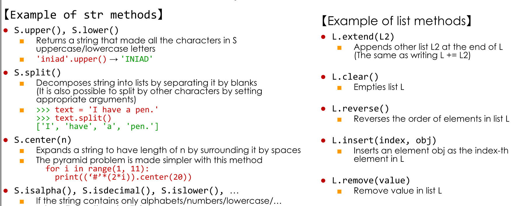

Python is an object oriented programming program.  
--> object methods.  
How to use method: object.method().  
## Str type method:  
+ s.find(sub): search for substring and return index, if not return -1.  
+ s.startswith(t):
+ s.endswith(t): if string S starts/ends with t, returns True.  
## List type methods:  
+ L.append(obj) 
+ L.pop(index)    
+ L.pop()  
+ L.index()  
+ L.copy()  
## Other methods:  

  

You can use help to use these methods.  
```
>> help(str)
```  
[Searching resoures](https://docs.python.org/3/reference/index.html)  

## Note: Using slide.  
**Basic implement:**  
```
a[start:stop]  # items start through stop-1
a[start:]      # items start through the rest of the array
a[:stop]       # items from the beginning through stop-1
a[:]           # a copy of the whole array
```  
You can manipulate the `step`:  
```
a[start:stop:step] # start through not past stop, by step
```  
The other feature is that `start` or `stop` maybe a negative number, which means it counts from the end of the array instead of the beginning.  
```
a[-1]    # last item in the array
a[-2:]   # last two items in the array
a[:-2]   # everything except the last two items
```  
Similarly, `step` maybe a negative number:  
```
a[::-1]    # all items in the array, reversed
a[1::-1]   # the first two items, reversed
a[:-3:-1]  # the last two items, reversed
a[-3::-1]  # everything except the last two items, reversed
```  
**Relation to `slice()` object.**  
`a[start:stop:step]` is equivalent to `a[slice(start, stop, step)]`  


