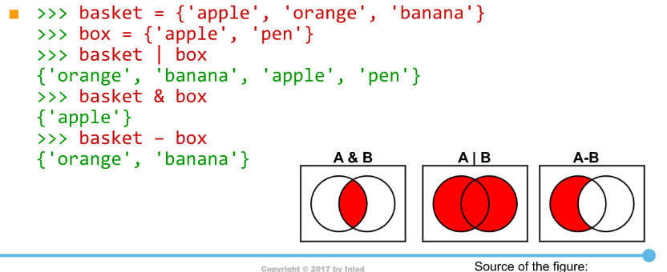

# Modules:
## 1. Modules    
```
import datetime
import random
```  
### **Method and attributes:**  
Object have methods and attributes:  
+ Method: function  
+ Attributes: variables.  
### **As...:**  
```
import datetime as d  
t = d.datetime.today()  
```  
### **From ...**    
```
from datetime import datetime, date  
t = datetime.today()
```  
### **Import everything using asterisk(*).**    
```
from datetime import *
t = datetime.today()
```  
In general, import everything is a bad ideal.  
## **2. Dictionaries, Sets, and Tuples**    
In addition to the last lession, we learn three new collections:  
+ Tuples (tuple)  
+ Dictionary (dict)  
+ Sets (set)  
### **Tuples**    
In a nutshell, they are "immutable" lists.  
```
>>> t = (100, 200, 300, 400)  
```  
### **Dictionaries**    
It works similar to map in C++.  
```
>>> translator = {'apple' : 'ringo', 'orange' : 'mikan'}
>>> ordinal = {1 : "first", 2 : "second", 3 : "third"}
# apple is a key, 'ringo' is the value tied to that key.
>>> translator['apple'] = 'ringo'
```  
Get the value:  
```
translator.get('orange')  # If not found, return nothing.  
```
Note: `translate[key]` is a **dangerous call**, because if the `key` is not presenting in the dict, the the program will return the error.  
#### **Operations on dict**  
Add
```
translate[key] = value
```  
Delete
```
del translator ['banana'] # the key
```  
Check if the key in the dict.  
```
>>> 'melon' in translator  
>>> False  
>>> 'melon' not in translator
>>> True  
```  
**Note:** in/not in can be used for lists/tuples as well.  
#### **Enumerating dictionaries**  
Enumerating keys:  
```
for key in dictionary:
    Block
```  
Enumerating values:
```
for value in dic.values():  
    Block
```  
Enumerating both keys and values:  
```
for key, value in dictionary.items():  
    Block
```  
Two dicts are indentical if the each of the key in the both dicts share the same values.  
The order of a dictionary is preserved internally in Py3.7 and above.  
### **Sets**  
Set is a dict, but have order.  
Set is work similar to DSU ???  
Intersection, union and difference of set A and B can be written as:  
+ A & B  
+ A | B  
+ A - B  

  

You can also use `in`, `not in` and `for`  


