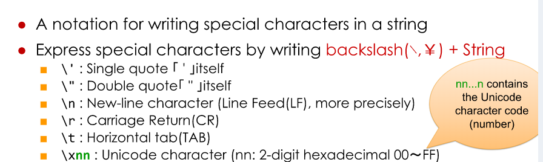
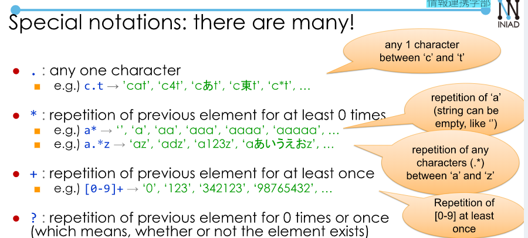
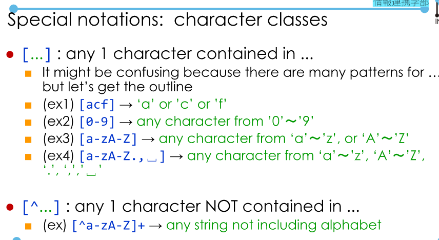
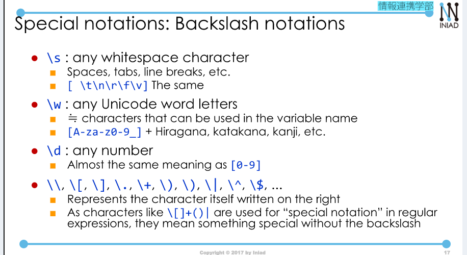
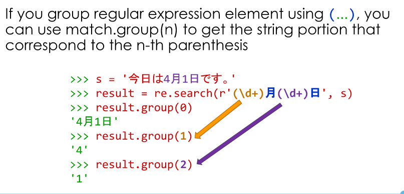
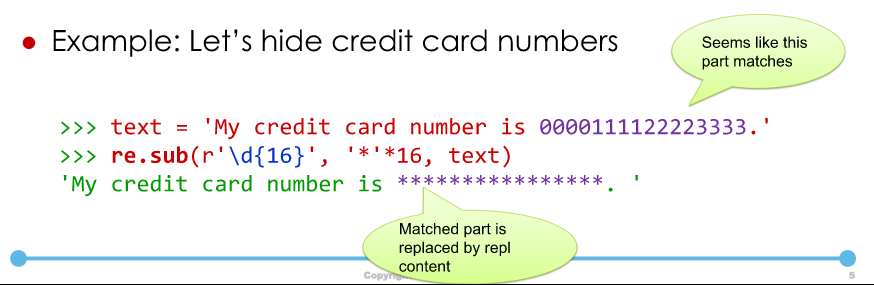
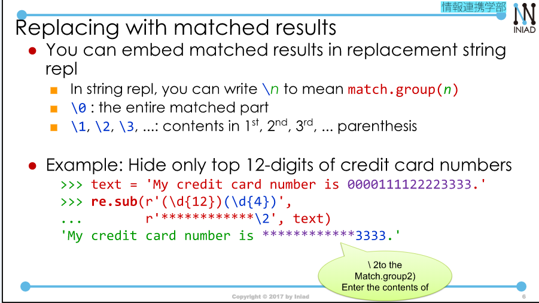

## 1. Topics on strings.  
Note: Built-in functions ord() and chr()  
```
>>> ord('A')
65
>>> chr(65)
'A'
```  
Escape sequence.  

  

### Multiline string.  
If you want to write a long string containing newlines, you can surround themm with triple quotes (""") and (''').  
### Raw string.  
```
>>> print(`C:\\Users\\INIAD`)
C:\Users\INIAD
>>> print(r'C:\Users\INIA')
C:\Users\INIAD  
```  
### str.format.  
str.format can be used to fill in the blanks in strings.
```
msg = "{0}/{1}: Today's weather is {2}"
msg.format(4,15, "sunny")
```
Other examples:  
```
>>> "{0:.5f}".format(100/3)  
33.33333
```  
### Formatted string literals (f-string)  
By adding "f" at the beginning like f'...' or f"...", you can embed expressions inside strings.  
```
male = True
family = "Inoue"
first = "Enryo"  
f'{"Mr" if male else "Ms"}.{first}{family}'  
```  
## 2. Searching with Regular Expressions  
str.find().  
Check if the inputted string is a valid telephone number.  
--> Take too much time.  
### Using regular expressions:
If you use regular expression library (re).  
You can write:  
```
import re

#check if it's an email using regular expression
if re.fullmatch(r"\w+@\w+(\.\w+)*", s)
    print("True)  

```  
Example: Check if a zip code or not.  
```
\d{3} - \d{4}
```  
Two useful functions:  
+ re.fullmatch(regexp, s):
+ re.search(regexp, s): Check a part of the string.  
### Return value of re.fullmatch and re.search.  
When matched, the return value is "match object".  
--> It can be use as true, false.
If it doesn't match. None is returned.  

  

  

  

  

### Beware of escape sequences:
Example: How can you write regular expression `\d{3}`  
+ `\\d{3}`  
+ r`\d{3}`  
When you use regular expression, use "raw string" when there is no particular reasons.  
**Note:** Regular expression is a dedicated language for expressing how a string is formed so don't mix it up with python.  
Example of a special notations: Beginning and the end.  
You can write in regular expression that the beginning and the end of the string are here!.  
Example: re.search(r"^\d{3}-\d{4}, s):
--> `115-0053` --> True
--> `P115-0053` --> False.  
Where to test regular expression: https://pythex.org/  

## 3. Search and Substitution with regukar expressions.  
How to omit/retrive a matched string?  
```
result = re.search(r'\d{3}-\d{4}', s)
result.group()  // result.group(0)
```  
### Taking out matched portions:  

  

### Substitution with regular expression  

  

### Replacing with matched results.  

  


