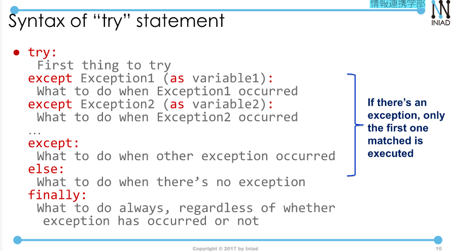
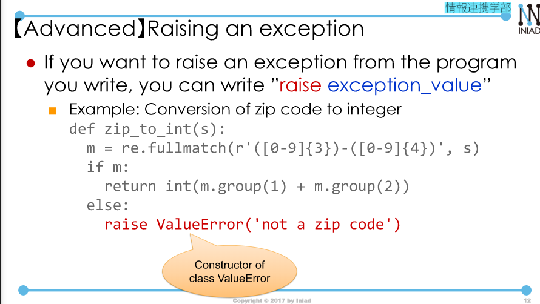
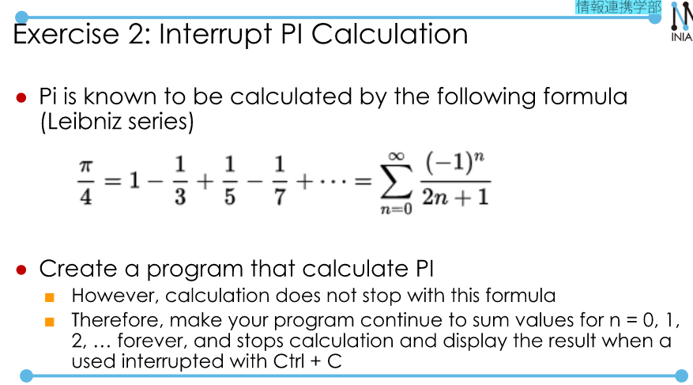
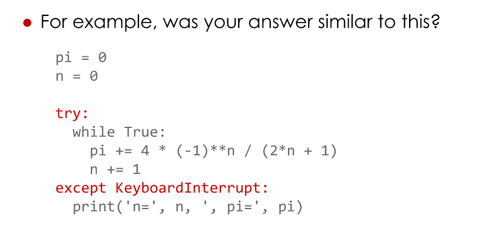
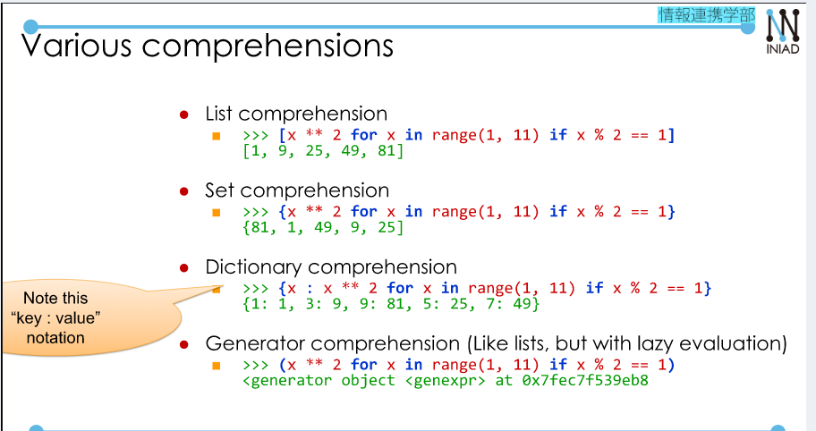
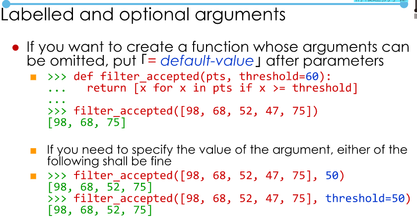
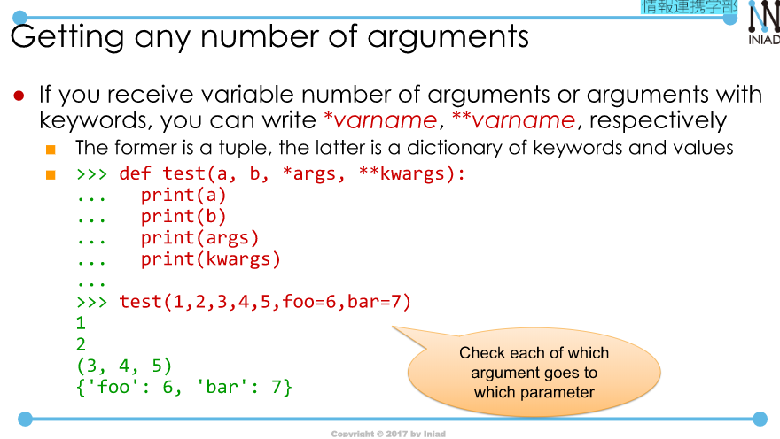
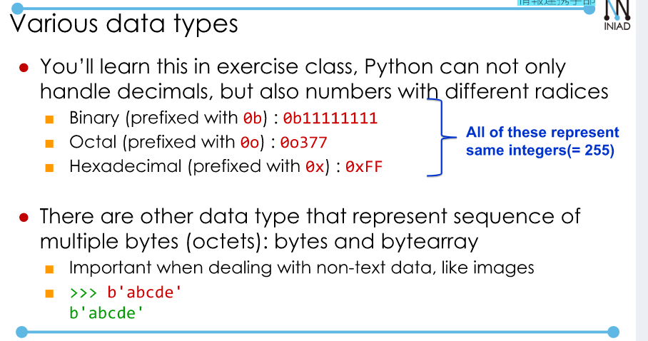
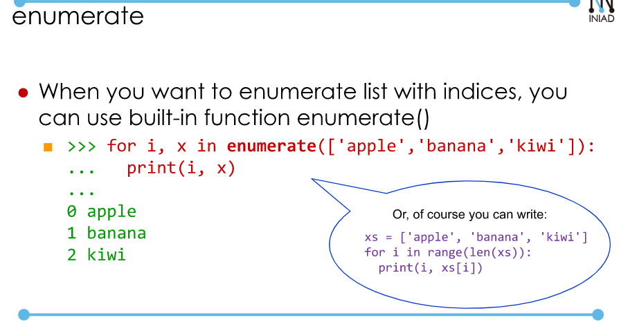

# Handling exceptions.  
## 1. Handling exceptions.  
```
While True:  
    try:
        r = float(input('r='))
        print('the area of circle is:', r*r*math.pi)
    except:
        print('Please input a number')  
```  
If you want to limit the type of error.  
- By writing `except Error_name:`, you can only handle certain types of errors.  
- In addition to that, you can add "as variable_name" to capture information of errors in variable specified.  
```
While True:  
    try:
        ...
    except ValueError as error:
        print('Error:" + str(error))
        print("PLease input a number")  
```  
### Syntax of "try" statement.  

  
Example:
```
def divide(x,y):
    try:
        result = x/y
        except ZeroDivisionError:
            print('Cannot divide by zero')  
        else:
            print('Result:', result)
        finally:
            print("Calculation is complete").  
```  
### [Advanced] Raising an exception.  
  
### Catching a program interruption.  
In order to stop a running program, you can type: [Ctril] + [C].  
When the program is stopped with [Ctrl] + [C], KeyboardInterrupt exception is raised.  
That means, if you catch KeyboardInterrupt exception, you can take actions when the program is interrupted.  

  

  

### [Advanced] More Python Functionalities.  
**Scopes**  
- Global values.
**Function as a value**  
- In Python, functions can be used as values:  
```
def f(x):
    return x*3
>> g = f
>> g(3)
>> 6
```  
**Lambda expressions and functions closures**  
```
>>> adder = lambda x,y: x + y
>> adder(2,3)
>> 5  
```  
You can even define function inside a function that uses it values called function closure.  
```
def multi_by(n):
    def multi(x):
        return x * n
    return mult
m = multi_by(3)
m(5)
>> 15.
```  
**Higher-order functions.**  
A function that takes a function as an argument or a return value is called a higher-order function --> `functional programming`.  
Example: function compose(f,g) that returns compostion of two functions, f(g(x)).  
```
def compose(f,g)
    return lambda x: f(g(x))
z = compose(round, max)
z([1.2, 3.4, 5.6])
>> 6
```  
**Built-in higher-order functions: map, filter.  
- map(f, xs): apply function f to all value of xs.  
```
list(map(lambda x: x*2, range(0, 10)))
```  
- filter(f, xs): filter elements that meets the criteria f from xs.  
```
>>> list(filter(lambda x: (x % 2) == 0, range(0,10)))
```  
- all(f, xs):  check if all the elements in list satisfy condition f.  
```
all(filter(lambda x: (x%2) == 0, range(0,10)))
>> True
```  
- any(f, xs): check if there's any element in list that satisfy condition f.  
```
any(filter(lambda x: x%2 == 0, range(0,10)))
>> False
```  
**Comprehensions**  
```
fruits = ["apple", "banana", "orange"]  
>> ['{} juice'.format(x) for x in fruits]  
>> ['apple juice', ...]  
>> [x ** 2 for in range(1,11) if (x % 2 == 1)]
?? [1, 9, 25, 49, 81]  
```  

  

**Non-boolean value in conditional expressions**  
Coversion rules to Boolean are different for each type:
- Collection types(list, etc.): True if non-empty, False if empty.  
```
def first(xs):
    if xs:
        return xs[0]
```  

  

**Getting any number of arguments**  
- If you receive variable number of arguments  

  

  

**Enumerate**  

  


