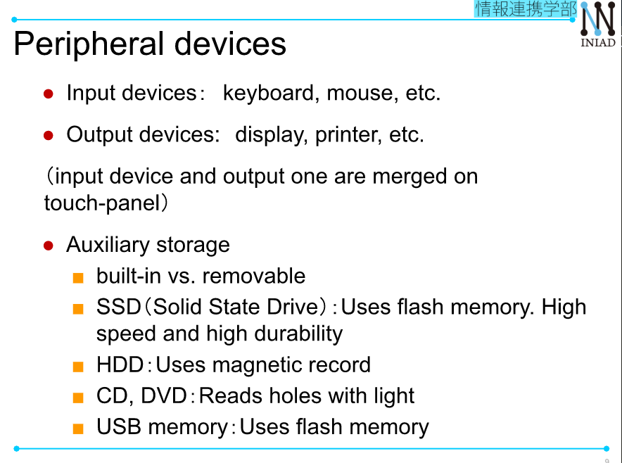

# Computer architecture and layered-structure.  
## 1. **Computer architecture**  
- What are computers?
    + Computer is an information processing system.  
    + Various computer: PC, Smart phone, Game machine, smart watch, etc...  
- Basic architecture of computers.  
    + CPU
    + Memory
    + Network
    + Peripheral devices (input, output)
--> Von Neumamn archtecture.  

  

  

### **CPU and memory**  
- CPU (Central Processing Unit).  
    + Reads programs and data from the memory, executes instructions in the programs, and write the result in the memory again.  
    - Memory: stores programs and data.  
    + ROM: (Read Only Memory): store data such as the program itself which should not vanish even after the program execution.  
    + RAM (Random Access Memory): store data such as variables in the program, which are used only during the computation process.  
### **OS(Operation System)**  
- OS = Basic software for computer behavior.  

  

  

### **Peripheral devices.**  

  

### **Network**  
- LAN: Local Area Network.  
- WAN: Wide Area Network.  
- Internet: Network connected with Internet Protocol.  
## **2. Layered structure of computers.**  
- Size of programs and layer structure.   
    + All arithmetic computation smart phone games and robol handling are done by programs.  
    + Windows XP program size was 45 million lines. Android is much bigger than that.  
    [More details](https://gigazine.net/news/20150918-google-2billion-code/)  
    + Smart phone games consist of a large amount of programs, but not all of them are written from scratch. Libraries such as "Unity" are used.  
    + "Layered structure" is the key to handle various types of large programs on a computer efficiently and easily.  

### **Layered structure of computer.**    

.  

  

  

  

  

### **Merit of Layered structure**.  
- When you develop upper layers services, you have to think about only the interface with the layer directly under.  
--> Ex: You can develop Windows applications without knowing CPU instruction sets if you only know Windows app APIs.  
- Each layer can evolve independently if It does not change the interface with the direct upper and lower layers.  
--> Ex: Applications come to run faster without changing the condes when hardwares and OS become faster.  

  

## **Layered-structure for files, file-system API**  
- API (Application Programming Interface) is a method to call OS functions from programs. Programs are developed using API.  

  

### **[FYI] Web API is a hot topic recently.**  

  

- [Google Map API](https://developers.google.com/maps/documentation/javascript/tutorial)  
- [Yahoo! API](https://developer.yahoo.co.jp/)  

### File system API.  
Uses file system from Python.  
- Folders and files are created with Windows explorer or commercial applications (MS Word, PowerPoint etc.), but can be operated from a program too. 
- e.g. When accessing a file collecting some data of the file.  

  

  

  

### **Absolute path.  

  

  

Note: `../` is go upstairs.  
### **File structure and handling by Python.**  
Module for file operation: os.  
```
>>> import os.  
```  
Typical file structure operations.  
+ Make directory: `os.mkdir(path)`.  
+ remove directory: `os.rmdir(path)`.  
Typical file operations (*import os is not needed*)  
- open file: `file = open(file_name, mode)`.  
- write into file: `file.write(string)`  
- read from file: `file.read()`
- close file `file.close()`  

**Ex. 1:** Make directory/file.  

  
Answer:
```
import os
os.mkdir("C:\users\taro\documents\example\)
memo = open(r"C:\....\example\memo.txt", "w")  
memo = write("Homework")  
memo.close()
```  
**"with" syntax**  
```
>>> with open(file_name, "w") as memo: 
# equal to memo = open(r"C:\....\example\memo.txt", "w")  
>>> memo.write("Homework")
```  
With this syntax, file_name is created, 'Homework' us written on the file and the file is closed.  

Note: `os.makedirs` also is an useful method.  
```
os.makedirs(r"../example2", exist_ok=True)
# exist_ok = True --> overwrite the current folder.
```  


