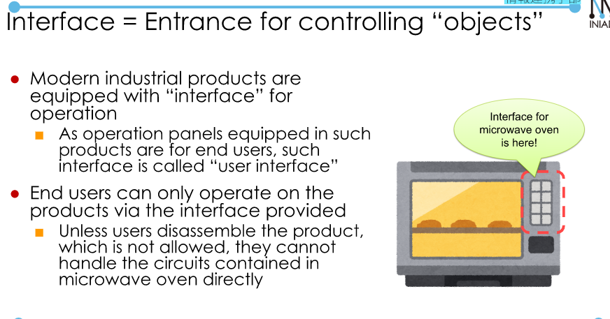
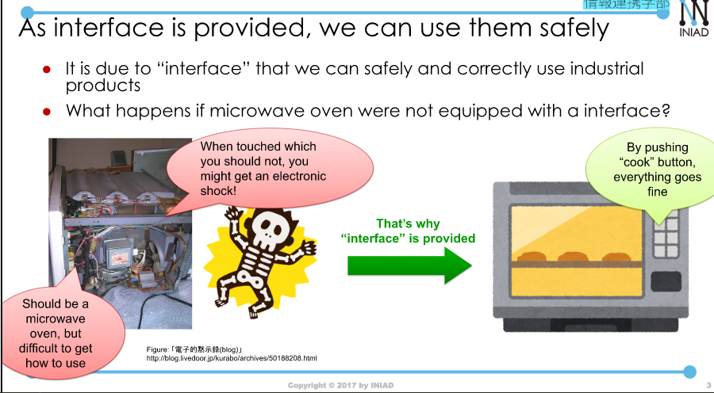
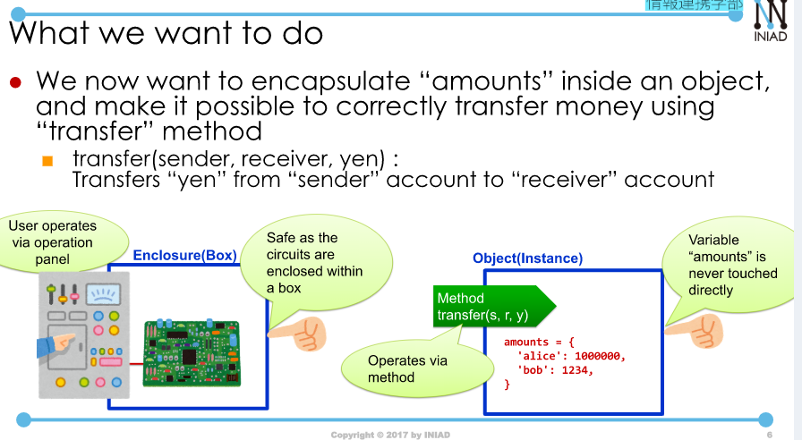
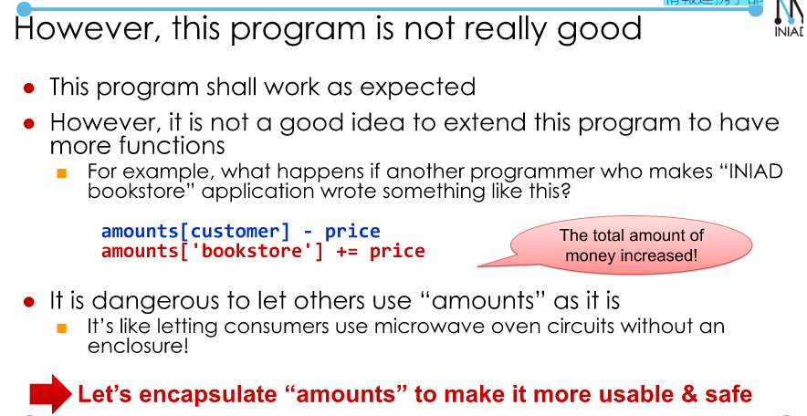
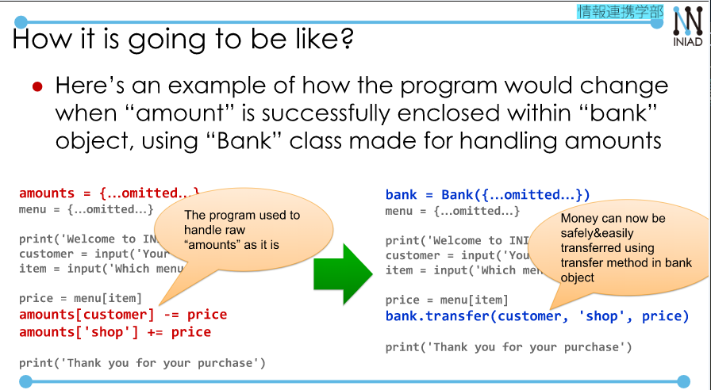
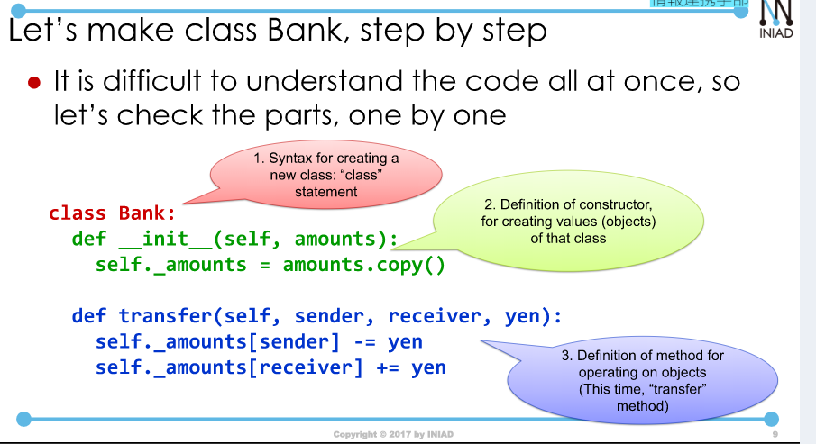
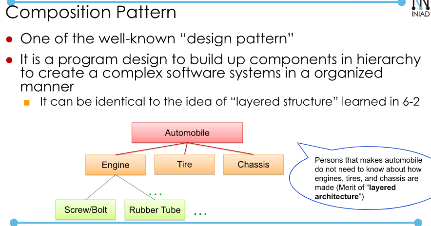
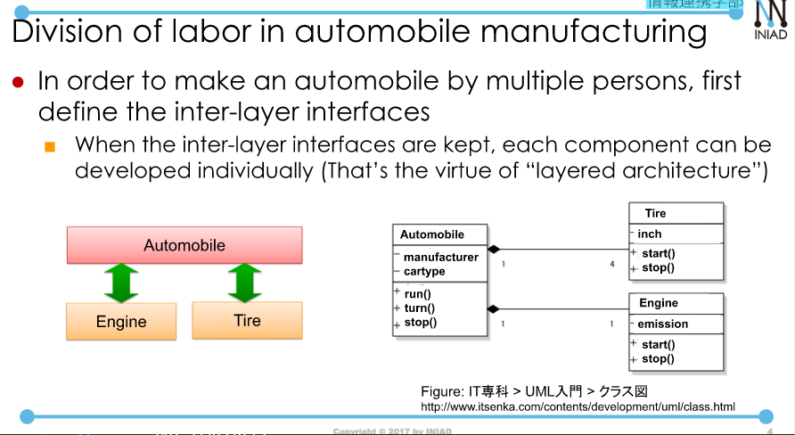
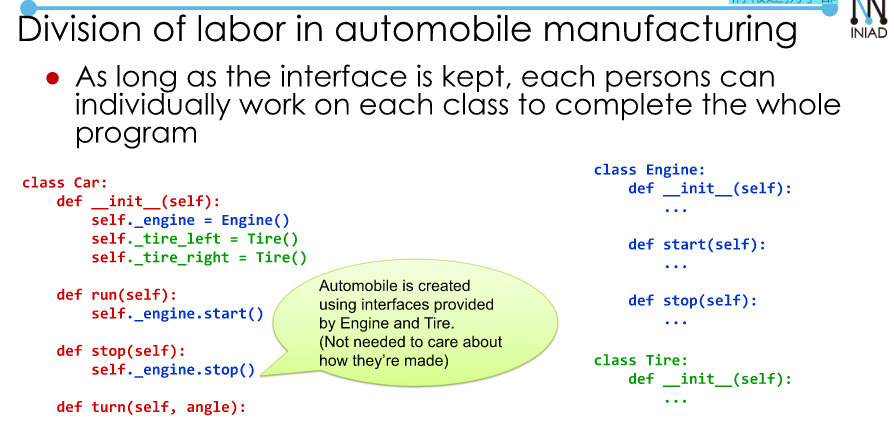

# 7.1. Object Oriented Programming and Abstraction using Interface.  
## 1. Encapsulation via Interface.  

  

  

Using that approach for software is called OOP(Object Oriented Programming).  
- In Python, all the values are treated as "objects", it work simlar to Jave.  
- Each object have: methods (ex. "INIAD".lower()) and attributes (ex val)  
From here, we will learn how to encapsulate your program componets in Python.  
## 2. Encapsulating an Electronic Cash System.  
  

  

  

Let'make Bank class to realize this.  
```
class Bank:
    def __init__(self, amounts): #constructor.
        self._amounts = amounts.copy()
    def transfer(self, sender, receiver, yen):
        self._amounts[sender] -= yen
        self._amounts[receiver] +=yen
```  

  

- Constructor: `bank = Bank(amounts)`  
## 3. Class Mechanisms in Python (Review).  
Let's review through an example simpler than bank. 
```
class Person:
    def __init__(self, first, family, age):
        sefl.first_name = first
        self.family_name = family
        self.age = age
    def full_name(self):
        return self.first_name + " " + self.family_name
```  
Create a person:
- `taro = Person("Taro", "Toyo", 29)`.  
- `hanako - Person("Hanako", "Akabane", 35)`.  
Attributes of an instance can be referred to as: `object.attribute_name`.  
Similarly, method can be referred as: `object.method_name(...)`.  
### [FYI(Advanced)] class methods and class instances.  
Not only instances, but also classes can be equipped with methods and attributes.  
- In the following example, Person.title and Person.add_tittle(name) can be used without an instance.  

```
class Person:
    tittle = 'san'

    @classmethod
    # It is important to write `@classmethod`.
    # use cls for class method.
    # use self for instance method.
    def add_tittle(cls, name):
        return name + ' ' + cls.title
```  
It is possible to inherit functionalities of an existing class, to make a new class equipped with additional attributes and methods (called class inheritance.).
```
class Animal:
    def __init__(self, name):
        self.name = name
    def walk(self):
        print(self.name, 'can walk')
class Bird(Animal): # Inherit from class Animal.
    def __init__(self, name)
        super().__init__(name) #Inherit method. 
    def fly(self):
        print(self.name, 'can fly')
```  
## 4. Composition of Program in a Object Oriented Way[Advanced].  

  

  

  


