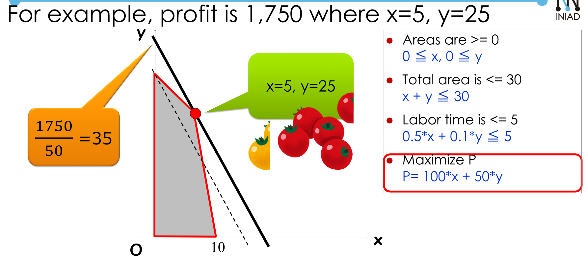

# Modeling and Data Representation  
## Farm management problem  
  

  

  

  

**Solve the problem by using LP**  

![solution.png]  

  

  

  

  

  

Solution:
```
import pulp
pr = pulp.LpProblem("Farm_mgnt.problem", pulp.LpMaximize)
x = pulp.LpVariable("x", lowBound = 0) # x >= 0
y = pulp.LpVariable("y", lowBound = 0) # y >= 0
pr += x + y <= 30 # condition 1.
pr += 0.5*x + 0.1*y <= 5 # condition 2.
pr += 100*x + 50*y # goal
pr.solve()
print("The maximum value can be achieved at x=" + str(x.value()) + " y=", str(y.value()))
```  
## Ordering operations for robots.  
We often have multiple tasks to be completed sequentially.  
Dependencies - a task must be done before another task.  
For example: put on a shirt --> put on socks --> put on shoes --> wear pants.  
To solve this kind of problem, we need to use directed graph, and use toposort algorithm.  
Solution:  
```
import toposort
list(toposort.toposort({
    'D' : {'A'},
    'E' : {'B'},
    'F' : {'B', 'C'},
    'G' : {'D', 'E'},
    'H' : {'F', 'G'}
    }
))
```  
## Ranking Web pages  
- Sucessful results of Web search will show important Web pages first based on ranking algorithms.  
- Learn how PageRank works, which is one of the most famous algorithm of ranking Web pages.  

Source: Lawrence Page, "Method for node ranking in a linked database" - 1977.  
**What are important pages in PageRank**  
- The importance of a page is not much increased by many links from other pages that are not importance to the page.  
- The importance of a page is increased by links from important pages to the page (even if there is only one link).  

  

  

  

  

```
import networkx as nx
g = nx.DiGraph()
g.add_node(1)
g.add_node(2)
g.add_node(3)
g.add_edge(1, 2)
g.add_edge(1,3)
g.add_edge(2,3)
g.add_edge(3,1)
pr = nx.pagerank(g, alpha = 1.0)
print(pr)
```  


