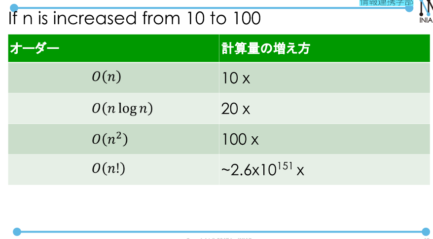

# Sort and Computational Complexitiy.  
# Sort  
Two methods:  
- `sorted(a)`  
- We can use specify values to compare: func(a) < func(b) instead of a < b.  
Example:  
```
Class Animal:
    def __init__(self, nm, spd):
        self.name = nm
        self.speed = spd
def get_speed(a):
    return a.speed
x = Animal(...)
y = Animal(...)
z = Animal(...)
a = [x,y,z]
sorted(a, key = get_speed)
```  
- We can also use sort instances of Animal class.  
```
Class Animal:
    def __init__(self, nm, spd):
        self.name = nm
        self.speed = spd
    def __lt__(self, other):
        return self.speed < other.speed
```  
## Sort and Computational Complexity.  
- Selection sort.  

  

## Quicksort.  
- Choose a pivot, and sort into two groups, one is bigger than it, one is smaller than it.  
- Average complexicity is O(nlog(n))  


