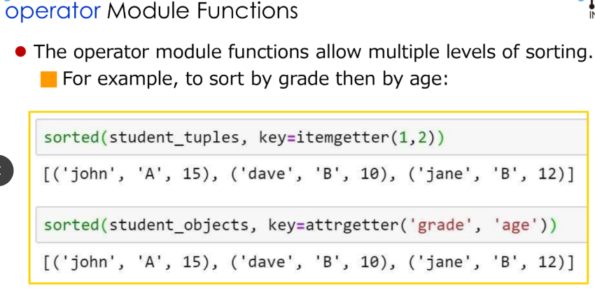

# Sort and Computational Complexitiy.  
# Sort  
Two methods:  
- `sorted(a)`  
- We can use specify values to compare: func(a) < func(b) instead of a < b.  
Example:  
```
Class Animal:
    def __init__(self, nm, spd):
        self.name = nm
        self.speed = spd
def get_speed(a):
    return a.speed
x = Animal(...)
y = Animal(...)
z = Animal(...)
a = [x,y,z]
sorted(a, key = get_speed)
```  
- We can also use sort instances of Animal class.  
```
Class Animal:
    def __init__(self, nm, spd):
        self.name = nm
        self.speed = spd
    def __lt__(self, other):
        return self.speed < other.speed
```  
A different between sort() and sorted() is that sort() is only used for list, while sorted is used for almost everything.  
**Key parameter**  
```
student_tuples = [('john', 2), ("Tuyen", 20), ("Uyen", 19)]
student_tuples = sorted(student_tuples, key = lambda student: student[1])
print(student_tuples)
```  
**repr method**  
```
class Student:
    def __init__(self, name, age):
        self.name = name
        self.age = age
    def __repr__(self):
        return repr([self.name, self.age])
    # def __str__(self):
    #     return "My name is " + self.name
Student1 = Student("Tuyen", 20)
print(Student1)
```  
You can use `repr` to represent a class.  
The key-function patterns shown here are very common, so Python provides functions to make acess to key easier and faster.  
- `itemgetter()`  
- `attrgetter()`
Source code:  
```
from operator import attrgetter, itemgetter
class Student:
    def __init__(self, name, age):
        self.name = name
        self.age = age
    def __repr__(self):
        return repr([self.name, self.age])
    def __lt__(self, other):
        return self.age > other.age
    # def __str__(self):
    #     return "My name is " + self.name
StudentA = Student("Tuyen", 20)
StudentB = Student("uyen", 15)
StudentC = Student("Chuyen", 25)
student_list = [StudentA, StudentB, StudentC]
student_list = sorted(student_list, key = attrgetter('age'))
print(student_list)
student_list = sorted(student_list)
print(student_list)
```  
As you can see, we can also use `__lt__` as a tool in sorting.  
  

**Reverse sorting:  Ascending and Descending**  
```
sorted(student_list, key = itemgetter(2), reverse = True)
```  

## Sort and Computational Complexity.  
Selection sort.  

  

**Binary search**  


## Quicksort.  
- Choose a pivot, and sort into two groups, one is bigger than it, one is smaller than it.  
- Average complexicity is O(nlog(n))  


