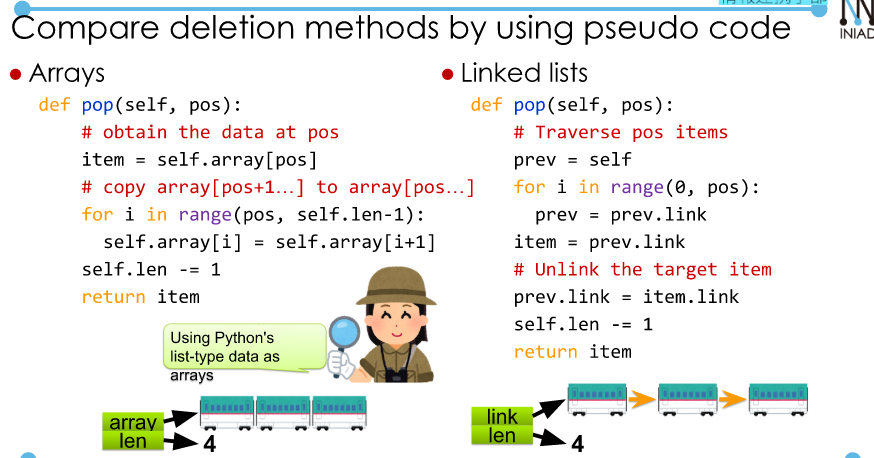
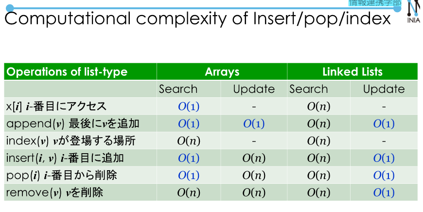
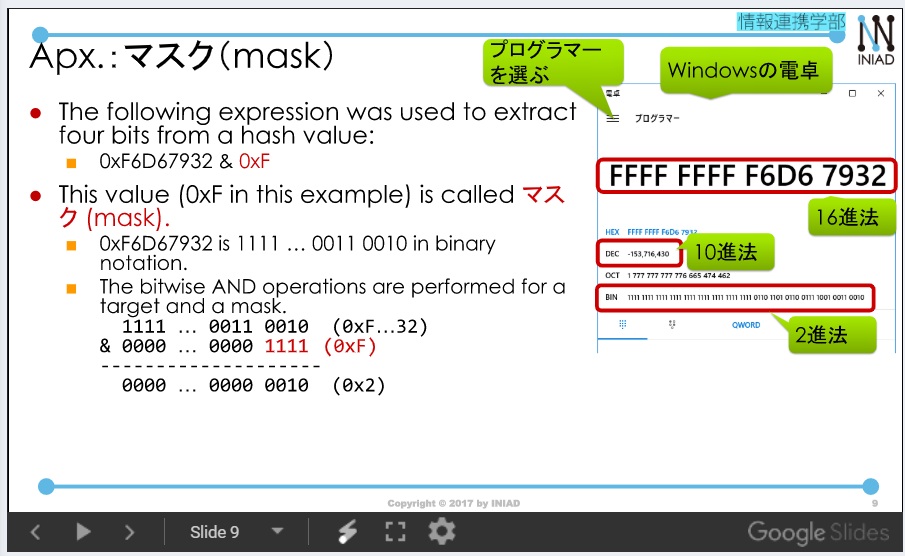
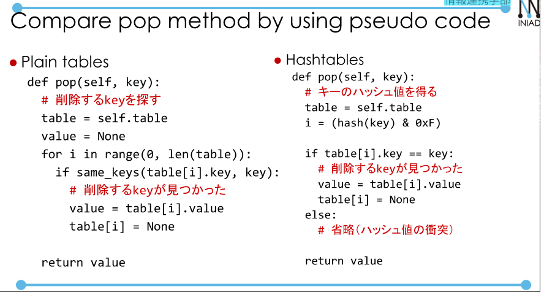

# Arrays, Linked Lists, Hash Tables.  
## Lists and Dicts.
List: Items are ordered in lists (0, 1st, 2nd, ...) Items can be accessed by using indices.  
Dict: Items are not ordered in dictionaries. Items can be accessed by using key objects.  
### Data structures for lists:
- Arrays
- Linked lists.  

**Arrays**  
- A contiguous region that consists of fixed-size sub-regions (i-th sub region is next to i+1-th sub region in the computer's memory).  
--> Accessing array is very fast.  

**Linked Lists**  
- Items are not neighboring, items can be traversed by using links.  

  

  

Python's list type is implemented by using arrays.  
Inserted is expensive because of **search** for sufficient space and **moving** entire arrays to another space if there is no room in arrays.  
## Dict and Hashtable.  
Implementation of dict:
- Key are not ordered in dict.  
- Keys should be looked up in dict quickly.    

Typical implementation of dict:  
- Plain tables.  
- Hash tables.  
### Implement dict by using plain tables.  
Plain tables:  
- New key and value pairs are added after the last added pairs.  
- Rows become emplty if keys and values on the rows are deleted. Empty rows will be reused if the last row of the table is used.  

--> Search requires O(n) time.  

### Hash tables.  
- Search requires O(1).  
- Calculate a hash value of key:  
--> Use built-in function to get keys:  `hash(orange) = -153716430`.  
Calculate a row number using a hash value.  
- Hash  values cannot be used as row numbers since they can be larger than the number of rows.  
Specific bitts of hash values are used to specify row number.  
```
>> OxF6467932 & oxF
2
```  
Note that this calculation of hash values and row numbers explains key aspects of Python but is simplified for explaination.  
  

  


