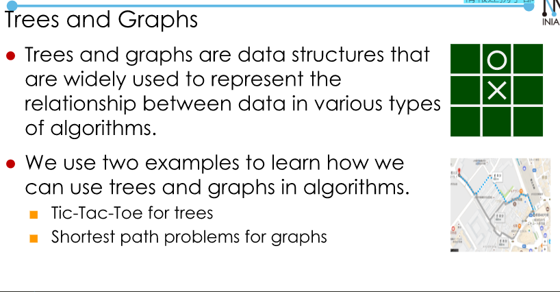
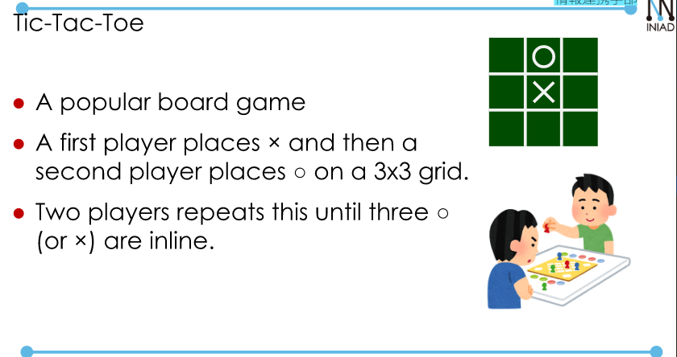
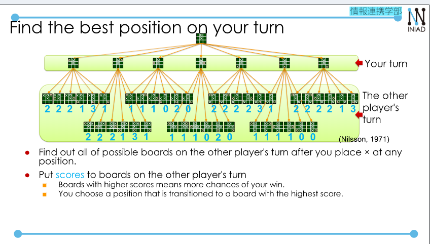
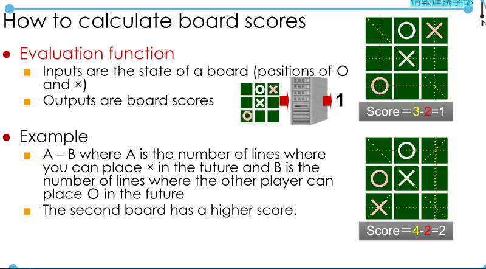
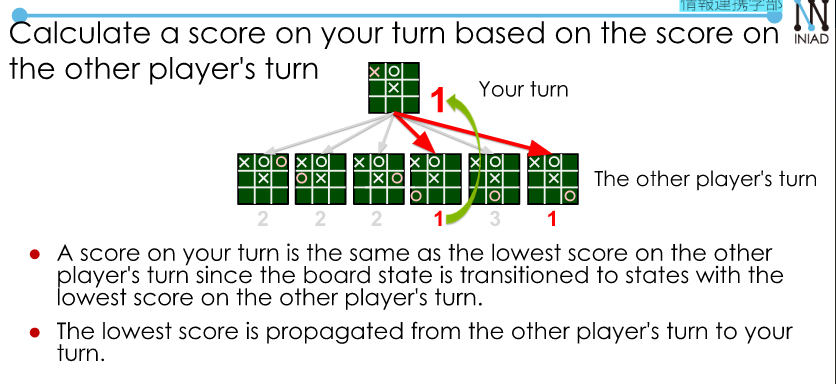
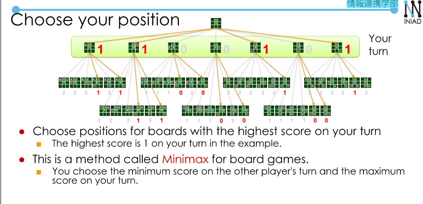
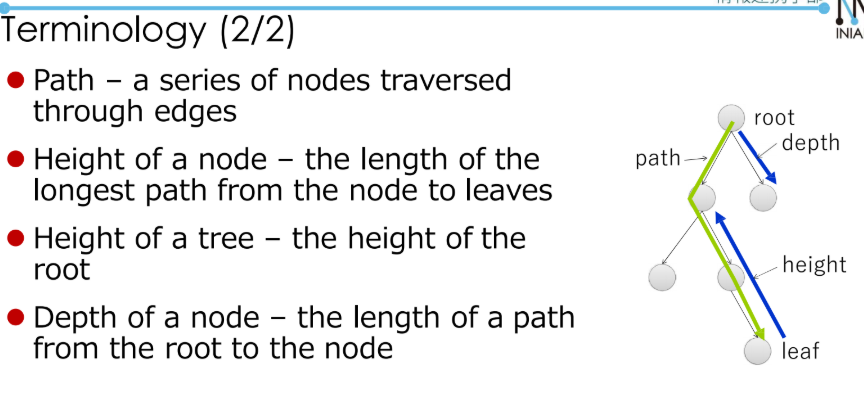
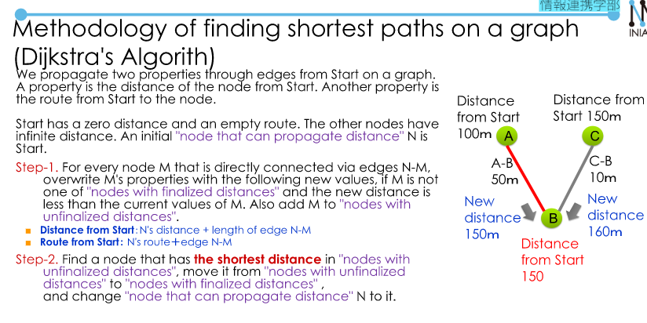

# Trees and Graphs.  
## Introduction.  

  

## Tree

  

  

  

Estimate a position on other players's turn.  
- The other player can choose one of six possible positions.  
- Suppose that *the other player must choose a position that result in the least chance you win*.  
- The board state is transitioned to states with the lowest score on the other player's turn.  

  

  

Terminology:  
- Nodes and edges  
- Parents and children  
- root, leaves  
- path  
- height of a node, tree  (distance from the node to the leaf)
- depth of a node (the length of a path from the root to the node)  

  

## Dijkstra problem.  

  

