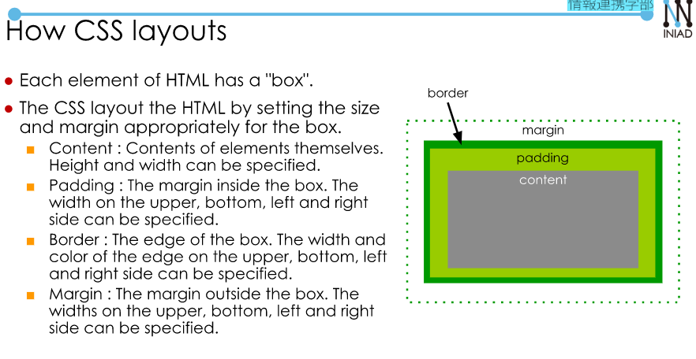

# HTML Training.  
My free style HTML training
## Note  
**Overall**  
When a web broser presents the content to the usesr, HTML/ CSS/ JavaaScript play the role:  
- HTML: Representing (static) information.  
- CSS: Laying out the page.  
- Javascript: Change the page dynamically.  
User Interface:  
- A point of interaction between two things.  
The interface used by programs to utilize operating systems, middleware, etc. are called API.  

**Tag**  
HTML:  
- `<Element>Content</Element>` 
- `<Element>`  
  + Some tags are used without end tag and contents
  + This kind of tag is called `empty element`  
- An element can have an attribute: `<element attribute1="Value1" attribute2 = "value2">`  

**Use form**  
```
  <form>
    <label for="infor">Do you want to know me more?</label>
    <select name = "contact">
      <option value = "Yes">Yes</option>
      <option value = "No">No</option>
    </select>
    <button onclick="info()">Submit</button>
  </form>
```  
- `name` to use to submit.    
- `value` to use for select buttom.  

**How to apply CSS to HTML using selectors**  
- We need to add description in `head` element: `<link rel="stylesheet" type = "text/css" href = "URL of CSS file">`  
- Describe by ID:  
    + `Element#ID`
    + `#ID`  
- Describe by Class:  
    + `Element.class`  
    + `.class`      
- Descendant selector:  `A B` - Specify all B in the descendants of A  
- Child selector: `A > B` Specify B as the child of A.  

- `name` attribute: Radio buttons with the same name will be grouped.  
```
      <p>
        <label for="id_radio2">Option2:</label>
        <input id="id_radio2" name="options" type="radio">
      </p>
      <p>
        <input type="submit" value="Submit">
        <input type="reset" value="Reset">
      </p>
```

- Select option:  
```
  <select name = "contact">
    <option value = "Yes">Yes</option>
    <option value = "No">No</option>
  </select>
```  
In HTML, id element is required to be **unique**.  

- Other:  
  + `hr`: horizontal break.  
  + `br`: perform a linefeed within a paragraph.  


**How to apply Javascript**  
- `<script src="js/assignment.js"></script>`  
- `Display` in `div`  

Note: Represent by ID: `#id`, by class: `.class_name`.  

**Table tag**  
- `<table>`: init  
- `th`: table header
- `tr`: table row  
- `td`: table data  

**Margin, Padding, Border**  
  

**Different between setTimeout and setInterval**  
- `setTimeout` is designed to execute a function after a certain of time.
- `setInterval` is designed to execute a function **periodically** after a certain of time.  

How to use:  
- `setTimeout(function, time_in_milisecond)`, `setInterval(function, time_in_milisecond)` to start the count time.  
- `clearTimeout(ID)`, `clearInterval(intervalId)` to clear the running process.  
Example:  
```
var intervalId;
function startInterval() {
  cnt = 0;
  intervalId = setInterval(updateContentInterval, 1000);
}

function stopInterval() {
  clearInterval(intervalId);
```  
**Regex review**  
- `re.sub(p, s)`:  
```
import re
text = "My bank number is: 000111231345"
print(re.sub("(\d{9})(\d{3})",'*'*9 + "\\2", text))
print(text)
```  
- To present special character like: `.`, we need to add "\".  
- Use sub:  
```
def changeName(name):
    return re.sub(r"M[rs]\. ([a-zA-Z]+) ([a-zA-Z]+)", r"\2 \1 san", name)
```  
Use findall()  
```
def yen(s):
    xs = re.findall("(\d+\.?\d*)", s)
    for x in xs:
        s = re.sub(x + " dollars", str(float(x) * 110.8) + " yens", s) 
    return s
```  


  

